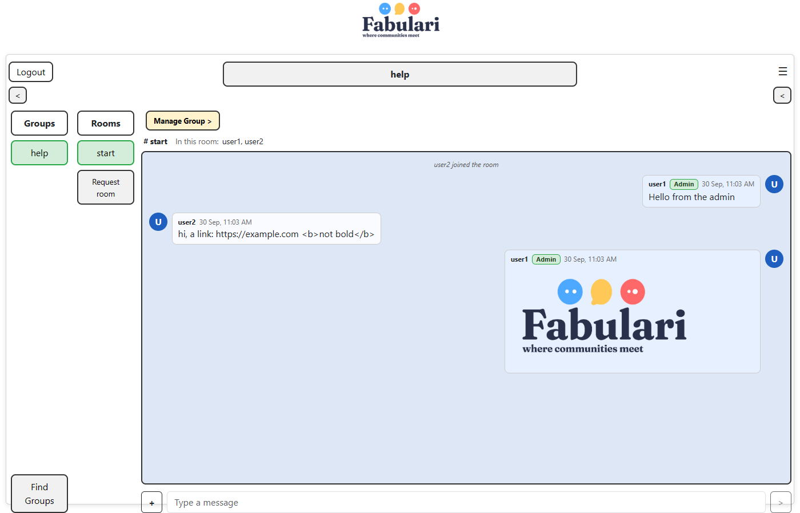
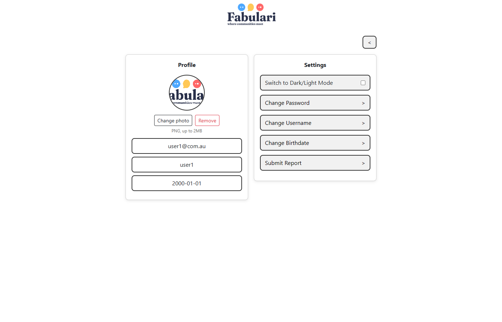
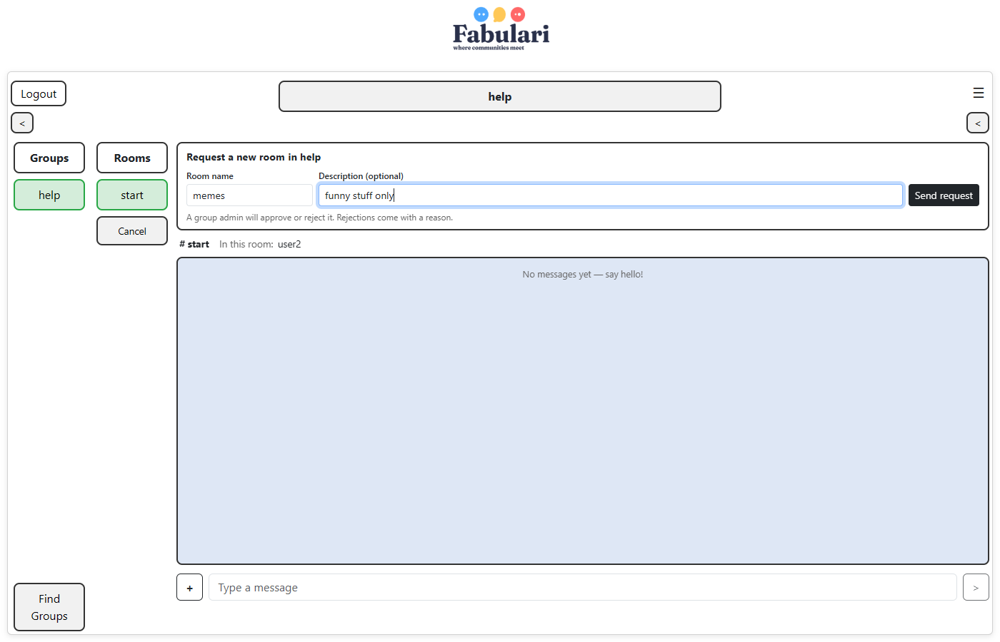
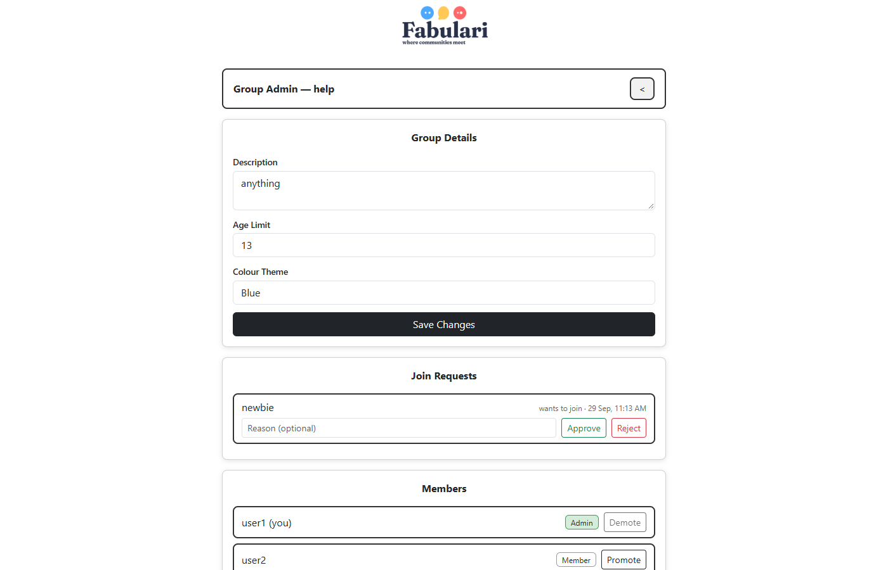
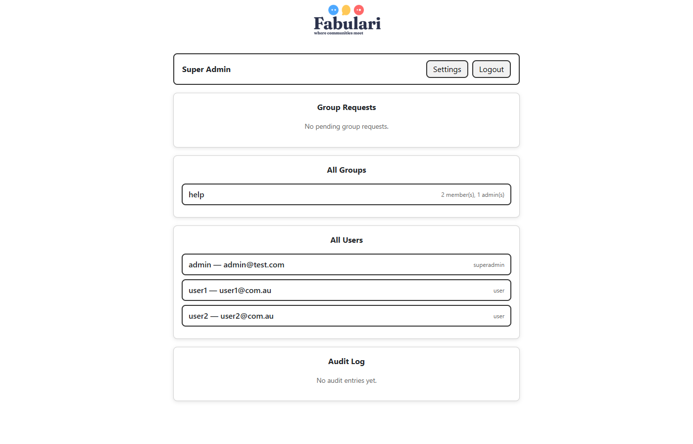

# Lachlan Barnett, s5438449, Thursday 9 - 11

# Fabulari — Phase 2

Fabulari is a real-time chat application built on the MEAN stack (MongoDB, Express, Angular, Node.js) with Socket.IO for live communication. Users sign up, browse groups, ask to join them, and chat in the group's rooms with text and PNG images. Group admins run their groups (members, rooms, join and room requests), and a single super admin approves new groups, group deletions and system-wide bans.

Phase 1 produced the specification, design and a prototype backed by a JSON file. Phase 2 turns that into the full application: MongoDB storage, hashed passwords and token authentication, real-time chat over sockets, image uploads, and the request/approval workflows described by the client.

> **Status markers** used below: ✅ done · ⏳ planned / in progress. This document is updated with every change.

## Contents

1. [Running the application](#running-the-application)
2. [Git workflow](#git-workflow)
3. [Specifications and requirements](#1-specifications-and-requirements)
4. [Server API documentation](#2-server-api-documentation)
5. [Angular architecture](#3-angular-components-services-and-models)
6. [Design documents](#4-design-documents)
7. [Testing](#5-testing)
8. [Changes from Phase 1](#changes-from-phase-1)

---

## Running the application

**Requirements:** Node.js, npm, and MongoDB running locally on the default port (`mongodb://127.0.0.1:27017`).

```bash
# 1. Server (Express + Socket.IO, port 3000)
cd Fabulari/server
npm install
npm run seed      # creates the "fabulari" database with demo data (wipes it first)
npm start         # runs listen.js

# 2. Client (Angular, port 4200) — in a second terminal
cd Fabulari
npm install
npx ng serve      # then open http://localhost:4200
```

**Demo accounts** (all passwords are `123`):

| Email | Role |
|---|---|
| `admin@test.com` | Super admin |
| `user1@com.au` | User — admin of the "help" group |
| `user2@com.au` | User — member of the "help" group |

**Configuration** (optional environment variables for the server): `MONGO_URL`, `DB_NAME` (default `fabulari`), `PORT` (default `3000`), `JWT_SECRET` (a development default is used if unset).

**Tests:** `cd Fabulari && npx ng test --watch=false` runs the Angular unit tests (see [Testing](#5-testing)).

---

## Git workflow

The repository follows the GitFlow-style strategy set out in Phase 1: `main` holds the submitted state, `develop` is the integration branch, and work happens on feature/phase branches (`phase1`, `phase2`) that are merged back. Phase 2 was built on the `phase2` branch as a series of small commits, one per logical change (a feature, a fix, or a refactor), so the history reads as a timeline of the build. Commit messages are short imperative summaries, e.g. *"Store the last 5 messages per room and send them as history on join"*.

---

## 1. Specifications and Requirements

The requirements come from the client Q&A (see `3813ICT Assignment Specifications.txt`) and are numbered as in Phase 1 (FR-1 to FR-40) so they can be compared directly. The **Implementation** column describes how Phase 2 meets each one.

### System / General

| ID | Requirement | Status | Implementation |
|---|---|---|---|
| FR-1 | Real-time delivery of messages between users in the same room. | ✅ | Socket.IO rooms (`room:<id>`); `message:new` is broadcast to everyone in the room. |
| FR-2 | Users register their own account (email, username, date of birth, password). | ✅ | `POST /api/signup`; email is unique (MongoDB unique index). |
| FR-3 | Passwords are hashed. | ✅ | bcrypt (`bcryptjs`, 10 salt rounds). Hashes are never sent to the client. |
| FR-4 | Change password: old password once, new password twice, checked on the server. | ✅ | The server checks all three fields, that the two new passwords match, and the old password against the hash. |
| FR-5 | No password recovery — a forgotten password means a new account. | ✅ | By design; no recovery endpoint. |
| FR-6 | Light / dark mode. | ✅ | Toggle in Settings; saved in the browser and applied at start-up. |
| FR-7 | Desktop first; tablet is a bonus. | ✅ / ⏳ | Desktop layout complete; tablet layout tidy-up planned. |
| FR-8 | PNG image messages, max 2MB. | ✅ | Upload endpoint checks the PNG file signature (first 8 bytes), not just the name, and rejects files over 2MB. |
| FR-9 | Groups have no profile picture. | ✅ | Identity is name, description and colour theme. |
| FR-10 | Links are shown as plain text, never as clickable links. | ✅ | Messages are rendered with Angular text interpolation, so HTML and URLs are displayed as text. |
| FR-11 | Only the 5 most recent messages per room are stored. | ✅ | Each new message trims the room to its newest 5 (and deletes files of trimmed images). While in a room you see everything from your session; rejoining shows the stored 5. |

### Users / Members

| ID | Requirement | Status | Implementation |
|---|---|---|---|
| FR-12 | Users can see all groups. | ✅ | Groups page lists every group with its description, age limit and theme. |
| FR-13 | Users request to join; under-age requests are rejected automatically. | ✅ | Join requests are auto-rejected with a reason when the user is under the group's age limit; otherwise a group admin approves. Users banned from the group can't apply again. |
| FR-14 | Users request a new group, supplying name, description, age limit and colour. | ✅ | "Request a new group" form on the Groups page → super admin. The requester becomes the new group's first admin. |
| FR-15 | Members propose rooms; an admin approves or rejects with a reason. | ✅ | "Request room" form on the chat page. Requests can't be cancelled. |
| FR-16 | A group may have no rooms. | ✅ | Empty states throughout the chat page. |
| FR-17 | Users see their pending and past-rejected requests. | ✅ | **My Requests** page (`/requests`) lists pending and rejected group, room and join requests with reasons. |
| FR-18 | Users send text and PNG messages in rooms they belong to. | ✅ | Membership is checked on the server for every join and every message. |
| FR-19 | Users see who is in the room and get join/leave notifications. | ✅ | "In this room" list and "X joined / X left the room" notices. A user with two tabs open counts once. |
| FR-20 | Private profile page with an optional photo; everything but email is editable. | ✅ | Settings page: change username, birthdate, password, and profile photo (PNG, 2MB). |
| FR-21 | Messages show a timestamp and the sender's photo. | ✅ | Server timestamp shown in the viewer's local time; sender's current photo (or initial). |
| FR-22 | Users can leave a group. | ⏳ | Planned. |

### Group Admin

| ID | Requirement | Status | Implementation |
|---|---|---|---|
| FR-23 | Edit description, age limit and colour theme (not the name). | ✅ | Group admin dashboard. Colour theme is limited to the logo colours: Blue, Yellow, Red. |
| FR-24 | The group's colour theme applies to its rooms. | ✅ | The chat area is tinted with the group's colour. |
| FR-25 | No limit on how many groups a user can administer. | ✅ | Role is stored per group membership. |
| FR-26 | Approve or reject room requests, with a reason for rejections. | ✅ | Admins can't approve their own requests (client: no self-approval). |
| FR-27 | Edit a room's name and description. | ⏳ | Planned. |
| FR-28 | Promote members; demote admins; a group always keeps one admin. | ✅ | Any admin can demote any admin, including themselves, unless they are the last one. |
| FR-29 | Ban a user from the group, based on a report. | ✅ | Members file reports (Settings → Submit Report). Group admins review them in the **Reports** panel: **Ban from group** (permanent — removes the member, records a ban, rejects any pending join request) or **Dismiss**. Admins can't act on reports they filed, and admins can't be banned (demote first). Banned users see a **Banned** badge on the Groups page. |
| FR-30 | Ask the super admin to remove a user from the whole system. | ⏳ | Planned. |
| FR-31 | Ask the super admin to delete the group. | ✅ | "Delete Group" panel → super admin approves or rejects. |
| FR-32 | Raising the age limit removes members who are now too young. | ⏳ | Planned. |
| FR-33 | See current and banned members of their group. | ✅ / ⏳ | Current members ✅; bans are recorded (FR-29) and a banned-members list on the dashboard is planned. |
| FR-34 | Admins are marked in chat. | ✅ | Green **Admin** badge on messages and in the member list. |

### Super Admin

| ID | Requirement | Status | Implementation |
|---|---|---|---|
| FR-35 | Exactly one super admin. | ✅ | Seeded; signup always creates normal users. |
| FR-36 | Super admin approves or rejects group requests; never creates groups directly. | ✅ | The direct "create group" route from Phase 1 was removed. |
| FR-37 | Super admin approves group deletions requested by a group admin. | ✅ | Approval removes the group with its rooms, messages, images and pending requests. |
| FR-38 | Super admin bans/deletes users at a group admin's request; banned emails can't be reused. | ⏳ | Planned. |
| FR-39 | Audit log, filterable by type, in date order. | ⏳ | Planned. |
| FR-40 | The super admin does not chat. | ✅ | Blocked on the server (join requests and socket events) and in the UI (the super admin lands on their dashboard). |

### Other decisions

| Decision | Reason |
|---|---|
| Users are identified by a login token (JWT) sent with every request and socket connection. | The server never trusts user ids sent by the client. |
| Admins can't be banned from their group; they must be demoted first. | Keeps the "always one admin" rule safe and makes removing an admin a deliberate two-step action. |
| Who is banned from a group is private. | Group lists only tell each user whether *they* are banned (`isBanned`). |
| Usernames aren't unique; email is. | Reports find the reported user by username *within the chosen group*. |
| Group and room names are unique (ignoring case). | Avoids confusing duplicates like "Gamers" and "gamers". |
| Message timestamps come from the server. | One source of truth; each browser shows it in local time. |
| Uploaded files get random names and are served with `nosniff`. | Unguessable addresses; browsers can't treat an upload as anything but a PNG. |

---

## 2. Server API Documentation

**Base URL:** `http://localhost:3000/api`. All request and response bodies are JSON unless noted. Error responses have the form `{ "message": "..." }`.

**Authentication.** `POST /auth` and `POST /signup` return a `token`. Every other endpoint needs the header `Authorization: Bearer <token>`; without a valid token the response is `401`. Access levels below:

| Access | Meaning |
|---|---|
| Public | No token needed. |
| User | Any logged-in user. |
| Self | Only the user named in the URL (`:userId` must be your own id). |
| Member | A member of the group in the URL. |
| Group admin | An admin of the group in the URL. |
| Super admin | The super admin only. |

Common errors: `400` invalid input · `401` not logged in / session expired · `403` not allowed · `404` not found · `409` conflict (duplicate, or already actioned) · `413` file too large · `500` unexpected server error.

### Auth

| Method | Endpoint | Access | Body | Response |
|---|---|---|---|---|
| POST | `/auth` | Public | `{ email, password }` | `{ valid: true, token, id, email, username, birthdate, role, profilePhoto }` or `{ valid: false }` for wrong details. `400` if fields are missing or not text. |
| POST | `/signup` | Public | `{ email, username, birthdate, password }` | Same as a successful login. `409` if the email is taken. |

### Users

| Method | Endpoint | Access | Body | Response |
|---|---|---|---|---|
| GET | `/users` | User | — | All users (no password hashes). |
| PUT | `/users/:userId` | Self | `{ username?, birthdate? }` | The updated user. |
| PUT | `/users/:userId/password` | Self | `{ currentPassword, newPassword, confirmPassword }` | `{ updated: true }`. `400` missing fields or new passwords don't match; `403` wrong current password. |
| PUT | `/users/:userId/photo` | Self | `multipart/form-data`, field `image` (PNG, ≤ 2MB) | The updated user with `profilePhoto` (e.g. `/uploads/avatars/2.png?v=…`). `400` not a PNG; `413` too large. |
| DELETE | `/users/:userId/photo` | Self | — | The updated user with `profilePhoto: null`. |

### Groups

| Method | Endpoint | Access | Body | Response |
|---|---|---|---|---|
| GET | `/groups` | User | — | All groups: `{ id, name, description, ageLimit, colourTheme, members: [{ userId, role }], isBanned }` — `isBanned` says whether *you* are banned; the full banned list is never sent. |
| GET | `/groups/:groupId` | User | — | One group. `404` if missing. |
| PUT | `/groups/:groupId` | Group admin | `{ description?, ageLimit?, colourTheme? }` | The updated group. `400` if the colour isn't Blue, Yellow or Red. |
| GET | `/groups/:groupId/members` | Member | — | `[{ userId, role, username }]` (no emails — profiles are private). |
| PUT | `/groups/:groupId/members/:userId/role` | Group admin | `{ role: "admin" \| "member" }` | The updated group. `409` if it would leave the group with no admin. |

### Join requests

| Method | Endpoint | Access | Body | Response |
|---|---|---|---|---|
| POST | `/groups/:groupId/join-requests` | User (not super admin) | — | The request: `status` is `pending`, or `rejected` with a reason if under the age limit. `403` banned from the group; `409` already a member / already pending. |
| GET | `/join-requests/mine` | User | — | Your join requests. |
| GET | `/groups/:groupId/join-requests` | Group admin | — | Pending requests, each with `username`. |
| PUT | `/groups/:groupId/join-requests/:requestId` | Group admin | `{ approve: boolean, reason? }` | The updated request. Approving adds the member (age re-checked: `400` if now too young). `409` already actioned. |

### Group requests (new groups)

| Method | Endpoint | Access | Body | Response |
|---|---|---|---|---|
| POST | `/group-requests` | User (not super admin) | `{ name, description?, ageLimit?, colourTheme? }` | The request. `409` if the name exists or is already requested. |
| GET | `/group-requests/mine` | User | — | Your group requests. |
| GET | `/admin/group-requests` | Super admin | — | Pending requests, each with `requesterName`. |
| PUT | `/admin/group-requests/:requestId` | Super admin | `{ approve: boolean, reason? }` | Approve → `{ request, group }` (requester becomes admin). Reject → the request. |

### Rooms and room requests

| Method | Endpoint | Access | Body | Response |
|---|---|---|---|---|
| GET | `/groups/:groupId/rooms` | Member | — | The group's rooms. |
| DELETE | `/groups/:groupId/rooms/:roomId` | Group admin | — | `{ deleted: true }`; also deletes the room's messages and images. |
| POST | `/groups/:groupId/room-requests` | Member | `{ name, description? }` | The request. `409` if the room exists or is already requested. |
| GET | `/room-requests/mine` | User | — | Your room requests. |
| GET | `/groups/:groupId/room-requests` | Group admin | — | Pending requests, each with `requesterName`. |
| PUT | `/groups/:groupId/room-requests/:requestId` | Group admin | `{ approve: boolean, reason }` | Approve → `{ request, room }`. Reject needs a `reason` (`400` otherwise). `403` for your own request. |

### Group deletion requests

| Method | Endpoint | Access | Body | Response |
|---|---|---|---|---|
| POST | `/groups/:groupId/delete-requests` | Group admin | `{ reason? }` | The request. `409` if one is already pending. |
| GET | `/groups/:groupId/delete-requests` | Group admin | — | This group's deletion requests, newest first. |
| GET | `/admin/group-delete-requests` | Super admin | — | Pending requests, each with `requesterName`. |
| PUT | `/admin/group-delete-requests/:requestId` | Super admin | `{ approve: boolean, reason? }` | The updated request. Approving deletes the group, its rooms, messages, images and pending requests. |

### Messages and images

| Method | Endpoint | Access | Body | Response |
|---|---|---|---|---|
| POST | `/rooms/:roomId/images` | Member of the room's group | `multipart/form-data`, field `image` (PNG, ≤ 2MB) | `{ url: "/uploads/<uuid>.png" }` — then send it with `message:send` (type `image`). `400` not a PNG / no file; `413` too large. |

Uploaded files are served at `http://localhost:3000/uploads/...`. Message history is delivered through the `room:join` socket event rather than a REST endpoint (see below).

### Reports

| Method | Endpoint | Access | Body | Response |
|---|---|---|---|---|
| POST | `/reports` | User | `{ groupId, username, reason }` | The report (`status: pending`). The reporter and the reported user must both be in the group. `400` reporting yourself. |
| GET | `/groups/:groupId/reports` | Group admin | — | Pending reports in the group, each with `reporterName` and `reportedName`. |
| PUT | `/groups/:groupId/reports/:reportId` | Group admin | `{ action: "ban" | "dismiss" }` | The updated report (`actioned` or `dismissed`). Ban removes the member, adds them to the group's ban list and records it in `bans`. `403` your own report; `409` the reported user is an admin, or already actioned. |

### Socket.IO events

Connect to `http://localhost:3000` with `{ auth: { token } }`; connections without a valid token are refused. Client → server events take an acknowledgement callback that receives `{ ok: true, ... }` or `{ ok: false, message }`.

| Event | Direction | Payload | Reply / notes |
|---|---|---|---|
| `room:join` | Client → Server | `{ roomId }` | `{ ok, history: Message[], present: [{ userId, username }] }`. Members only; refused for the super admin. |
| `room:leave` | Client → Server | `{ roomId }` | `{ ok: true }` |
| `message:send` | Client → Server | `{ roomId, type: "text" \| "image", content }` | `{ ok, message }`. Must have joined the room. Text: trimmed, 1–2000 characters. Image: a path returned by the upload endpoint. |
| `message:new` | Server → Client | `Message` | Sent to everyone in the room, including the sender. |
| `presence:update` | Server → Client | `{ roomId, users }` | The full "in this room" list whenever it changes. |
| `presence:joined` | Server → Client | `{ roomId, user }` | Someone joined (not sent to the person joining). |
| `presence:left` | Server → Client | `{ roomId, user }` | Someone left or disconnected. |

`Message` = `{ id, roomId, senderId, senderName, senderPhoto, type, content, timestamp }`.

### Database (MongoDB)

Database `fabulari`. Every document has a numeric `id` (generated from the `counters` collection); Mongo's internal `_id` is never sent to the client.

| Collection | Fields |
|---|---|
| `users` | `id, email (unique), username, birthdate, passwordHash, role ("user" \| "superadmin"), profilePhoto` |
| `groups` | `id, name, description, ageLimit, colourTheme, members: [{ userId, role }], bannedUserIds` |
| `rooms` | `id, groupId, name, description, createdAt` |
| `messages` | `id, roomId, senderId, senderName, type, content, timestamp` — at most 5 per room |
| `joinRequests` | `id, groupId, userId, status, rejectionReason, reviewedBy, createdAt` |
| `groupRequests` | `id, requestedBy, name, description, ageLimit, colourTheme, status, rejectionReason, reviewedBy, createdAt` |
| `roomRequests` | `id, groupId, requestedBy, name, description, status, rejectionReason, reviewedBy, createdAt` |
| `groupDeleteRequests` | `id, groupId, groupName, requestedBy, reason, status, rejectionReason, reviewedBy, createdAt` |
| `reports` | `id, reportedUserId, reportedBy, groupId, reason, status (pending / actioned / dismissed), reviewedBy, createdAt` |
| `bans` | `id, userId, scope ("group"), groupId, reportId, issuedBy, createdAt` |
| `counters` | `_id` (collection name), `seq` |

### Server files

| File | Purpose |
|---|---|
| `listen.js` | Connects to MongoDB, then starts the server on port 3000. |
| `server.js` | Builds the Express + Socket.IO server around a database connection. |
| `index.js` | All REST routes. |
| `socket.js` | Socket authentication, rooms, presence and messages. |
| `auth.js` | Login tokens and the access checks (`requireAuth`, `requireSelf`, `requireGroupMember`, `requireGroupAdmin`, `requireSuperAdmin`). |
| `db.js` | MongoDB connection, indexes and numeric ids. |
| `uploads.js` | PNG checks, saving and deleting uploaded images and profile photos. |
| `seed.js` | `npm run seed` — resets the database and uploads with demo data. |

---

## 3. Angular Components, Services and Models

The client is an Angular 22 standalone-component app. State is held in **signals**; the socket service exposes **Observables** that components turn into signals. The app runs without Zone.js, so anything the template shows is kept in a signal.

### Components

| Component | Route | Purpose |
|---|---|---|
| `App` | — | Root: logo, router outlet, applies saved dark mode. |
| `Login` | `/` | Email/password login; sends the user to their home page (chat, or the dashboard for the super admin). |
| `Signup` | `/signup` | Registration form. |
| `Chat` | `/chat` | Main page: groups and rooms columns, live messages (text and images, timestamps, photos, admin badges), who's in the room, join/leave notices, send box with image attach, "Request room" form, and the group info panel (description, age limit, colour, members). |
| `Groups` | `/groups` | All groups with Apply / Pending / Member / Admin / Banned state and rejection reasons; "Request a new group" form. |
| `MyRequests` | `/requests` | The user's pending and rejected requests of every kind. |
| `Settings` | `/settings` | Profile (photo upload/remove, email, username, birthdate) and settings (dark mode, change password/username/birthdate, my requests, report). |
| `ChangePassword` | `/change-password` | Current password + new password twice. |
| `ChangeUsername` | `/change-username` | New username. |
| `ChangeBirthdate` | `/change-birthdate` | New birthdate. |
| `Report` | `/report` | Report a member of one of your groups. |
| `GroupAdminDashboard` | `/admin/group/:groupId` | Edit group details; approve/reject join requests; review reports (ban or dismiss); members with promote/demote; channels; approve/reject channel requests; request group deletion. |
| `SuperAdminDashboard` | `/admin/super` | Approve/reject group requests and group deletion requests; all groups; all users; audit log (planned); Settings and Logout. |

### Services

| Service | Purpose |
|---|---|
| `AuthService` | Login, signup, logout; holds the current user and token (signals, saved in the browser); `updateCurrentUser()` after profile changes; `homeUrl` per role. |
| `authInterceptor` | Adds the token to every HTTP request; logs the user out on `401`. |
| `ChatSocketService` | Wraps Socket.IO: `connect`, `joinRoom` (returns history + who's present), `leaveRoom`, `sendMessage`; streams `messages$`, `presence$`, `activity$`, `notifications$`, `errors$`. Disconnects on logout. |

### Route guards

| Guard | Used on | Rule |
|---|---|---|
| `authGuard` | All pages except login/signup | Must be logged in. |
| `guestGuard` | `/`, `/signup` | Logged-in users go to their home page. |
| `notSuperAdminGuard` | `/chat`, `/groups`, `/requests` | Sends the super admin to their dashboard. |
| `groupAdminGuard` | `/admin/group/:groupId` | Must be an admin of that group (checked with the server each time). |
| `superAdminGuard` | `/admin/super` | Super admin only. |

### Models (`src/app/models`)

| Model | Fields |
|---|---|
| `User` | `id, email, username, birthdate, role, profilePhoto?` |
| `Group`, `GroupMember`, `GroupMemberDetails` | Group with `members: { userId, role }[]` and `isBanned`; details add `username`. |
| `Room` | `id, groupId, name, description, createdAt?` |
| `Message`, `PresentUser`, `PresenceEvent` | Chat message; a user in a room; joined/left notice. |
| `JoinRequest`, `GroupRequest`, `RoomRequest`, `GroupDeleteRequest` | Share `id, status, rejectionReason, reviewedBy, createdAt`. |
| `Report` | `id, reportedUserId, reportedBy, groupId, reason, status, reviewedBy, createdAt`, plus `reporterName` / `reportedName` for admins |
| `ColourTheme`, `COLOUR_THEMES`, `THEME_TINTS` | `'Blue' \| 'Yellow' \| 'Red'` and their chat tints. |
| `AuditLogEntry` | `type, details, timestamp` (planned feature). |

`src/app/api.config.ts` holds the server address (`SERVER_URL`, `API_URL`, `SOCKET_URL`).

---

## 4. Design Documents

The Phase 1 wireframes still describe the layout; the screenshots below show the finished pages.

| Page | Phase 1 wireframe | Phase 2 |
|---|---|---|
| Chat |  |  |
| Settings |  |  |

**Chat page.** As in the wireframe: groups and rooms on the left, messages in the middle, group info on the right (toggled with the arrow buttons). Added in Phase 2: the room bar ("# start · In this room: user1, user2"), message bubbles with photo, name, **Admin** badge and time (your own on the right), join/leave notices, the **+** button for PNG images, and the **Request room** button and form:



**Settings page.** The profile panel now shows the profile photo with Add/Change/Remove buttons. The Profile panel stays display-only; changes are made from the Settings panel's buttons.

**Group admin dashboard** (new): panels for group details, join requests, reports, members, channels, channel requests and group deletion.



**Super admin dashboard** (new): group requests, group deletion requests, all groups, all users and the audit log.



The login, signup, groups, change password and change username pages keep their Phase 1 wireframe layouts (see `Phase1.md`).

**Responsive design.** Desktop is the main target. Below 900px the side columns narrow and the message area shortens. ⏳ A fuller tablet layout is planned.

---

## 5. Testing

### Tools and approach

| Level | Tools | What it covers |
|---|---|---|
| **Unit / component tests** (automated, in the repo) | Vitest through Angular's unit-test builder, jsdom, Angular `TestBed`, `HttpTestingController` | Components render the right things and send the right HTTP requests; guards; the socket service (with a fake socket). No server needed. Run with `npx ng test --watch=false`. |
| **API and socket tests** (scripted) | Node scripts using `fetch` and `socket.io-client` against the real server and a freshly seeded MongoDB | Every endpoint's success and error cases, permissions, and socket behaviour (presence, history, images, photos, deletions). ⏳ Being moved into the repo as an automated test suite. |
| **End-to-end tests** (scripted) | Puppeteer driving headless Chrome against `ng serve` + the server | Real user flows across two browser sessions: chatting, images, profile photos, joining a group, requesting a room, super admin routing. ⏳ To be added to the repo. |

Testing approach: every change is checked with the unit tests and a production build, and server changes are checked against the running server with the scripted API tests. End-to-end runs confirm key flows in a real browser, and caught bugs that the unit tests missed (for example, the message box not clearing after sending).

Shared test setup (`src/test-setup.ts`): provides an in-memory `localStorage` (Node 25+ has its own that doesn't work in tests), clears it before each test, and restores all spies after each test.

### Automated unit tests (87 tests, all passing)

| Area | File | Tests |
|---|---|---|
| App | `app.spec.ts` | Creates the app · renders the logo · applies saved dark mode on start-up · light mode by default |
| Chat | `chat.spec.ts` | Joins the first room and shows who is present · shows history from joining · shows live messages for the current room with an Admin badge · shows the sender's photo or initial · shows join and leave notices · sends the typed message and clears the box · shows the server error and keeps the text · **images:** uploads a PNG then sends it · refuses non-PNG files · refuses images over 2MB · shows upload errors · shows image messages · **requesting a room:** opens a labelled form · sends the request and confirms · needs a name · shows the server error · leaves the old room when switching · leaves the room when the page closes |
| Chat socket service | `chat-socket.service.spec.ts` | Connects with the login token · opens only one connection · doesn't connect when logged out · join returns history and who's present · rejects a refused join · send returns the stored message · emits `room:leave` · passes incoming messages to `messages$` · turns joined/left events into `activity$` · disconnects on logout |
| Groups | `groups.spec.ts` | Shows Admin, Pending, rejected reason and Apply · shows Banned with no Apply button · sends a join request and shows Pending · request form has labelled fields and the three colours · sends the group request and clears the form · needs a name · rejects a bad age limit · shows the server error |
| My Requests | `my-requests.spec.ts` | Lists pending requests of every kind with group names · lists rejected requests with reasons · leaves approved requests out · shows an error if loading fails |
| Settings | `settings.spec.ts` | Back arrow goes to the user's home page · shows profile details · shows initial and "Add photo" · uploads a PNG and shows the photo · rejects non-PNG and oversized photos · removes the photo · shows upload errors |
| Group admin dashboard | `group-admin-dashboard.spec.ts` | Lists join requests · empty note · approving adds the member · rejecting sends the reason · shows the server error · **reports:** lists who reported whom and why · bans after confirming and removes the member · cancelling does nothing · dismisses without banning · can't act on your own report · shows the server error · can't action your own channel request · needs a reason to reject a channel request · sends a deletion request after confirming · cancelling does nothing · shows a pending deletion · shows why the last deletion was rejected · marks you and disables demoting the only admin |
| Super admin dashboard | `super-admin-dashboard.spec.ts` | Lists group requests · approves a group request · lists deletion requests with reasons · deletes after confirming · cancelling does nothing · rejects without confirming |
| Guards | `group-admin.guard.spec.ts`, `not-super-admin.guard.spec.ts` | Admin allowed · member redirected · missing group redirected · logged-out redirected without a server call · normal users allowed · super admin redirected to the dashboard |
| Other pages | `login`, `signup`, `report`, `change-password`, `change-username`, `change-birthdate` | Each page is created |

### Scripted API and socket checks

| Script | Checks | Covers |
|---|---|---|
| REST regression | 96 | Login, signup, hashing, tokens, permissions on every route, password change, colours, members, reports, join/group/room requests, roles, non-text credentials |
| Sockets | 29 | Token check, join rules, presence (including two tabs), message validation, leave and disconnect |
| History | 17 | Only the last 5 messages kept per room, order, rejoining, deletion with the room |
| Images | 24 | Real PNG accepted, renamed JPEG rejected, 2MB limit, permissions, serving headers, cleanup |
| Profile photos | 22 | Upload, validation, permissions, photo on messages and history, changing and removing |
| Super admin | 7 | Can't join groups or chat, even if added to a group directly |
| Group deletion | 22 | Permissions, one pending request, reject, approve removes everything |
| Reports and bans | 20 | Permissions, ban removes the member and blocks rooms, chat and reapplying, ban record, dismiss, no self-review, admins can't be banned, ban list kept private |
| End-to-end (Chrome) | 45 | Chat 19 · photo 5 · super admin 8 · join 7 · request room 6 (including 2 on-screen layout checks) |

---

## Changes from Phase 1

| Area | Phase 1 | Phase 2 |
|---|---|---|
| Storage | JSON file (`data.json`) | MongoDB, with a seed script |
| Passwords | Plain text | bcrypt hashes |
| Identity | Client sent its own user id | Login token (JWT) checked on every request and socket |
| Joining a group | Instant | Join request, admin approval, automatic age check |
| Creating groups | Super admin created them directly | Only by approving a user's request |
| Creating rooms | Group admin created them directly | Only by approving a member's request |
| Chat | Placeholder | Live Socket.IO chat with presence, history, images and photos |
| Colour theme | Free text | Blue / Yellow / Red |
| Models | Copied into each component | Shared `models/` folder |
| Message history endpoint | `GET /api/rooms/:roomId/messages` | Returned by the `room:join` socket event instead |
| Group request field | `title` | `name` (matches the Group) |
| Tests | Broken starter specs | 87 unit tests plus scripted API, socket and browser checks |
