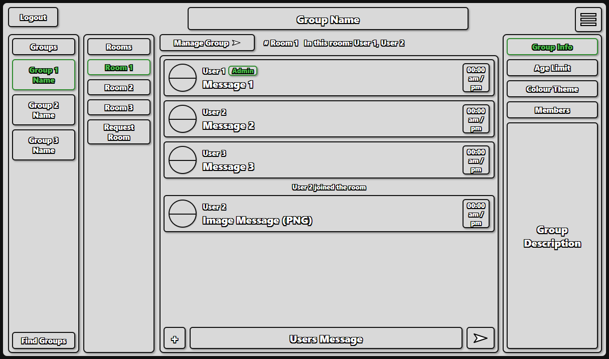
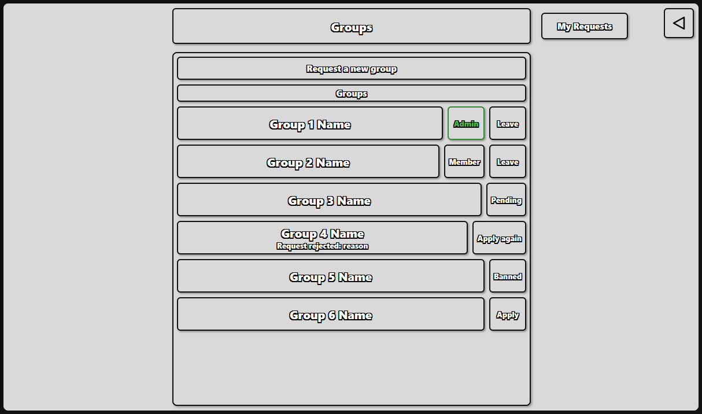
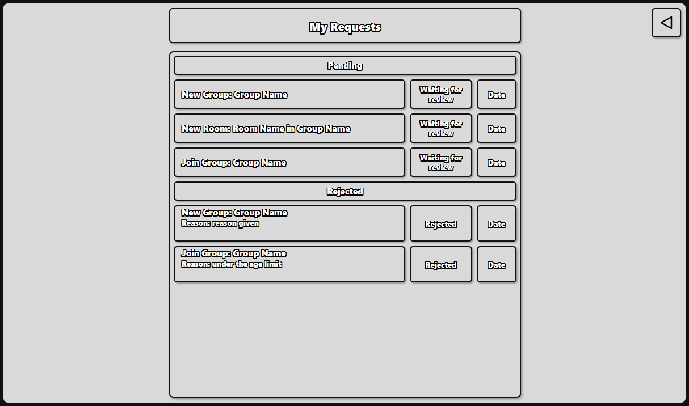
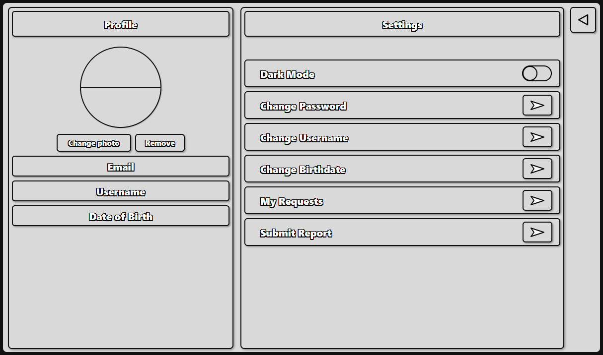
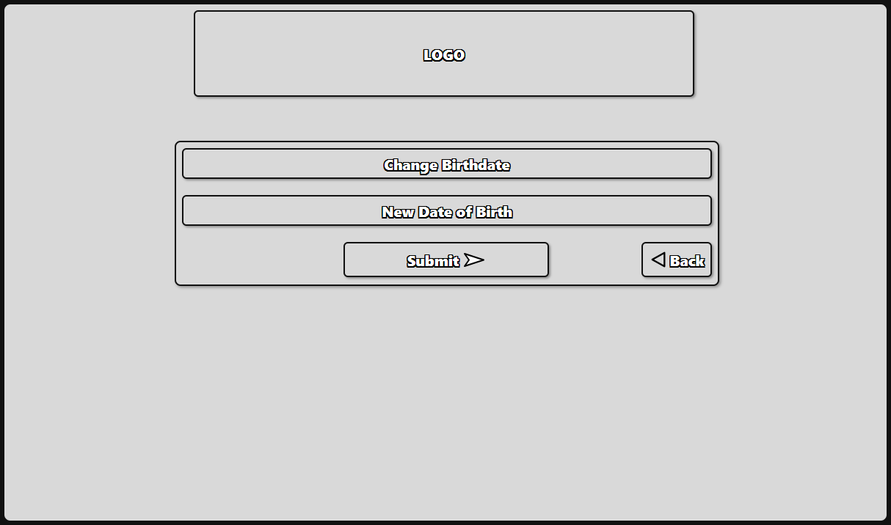
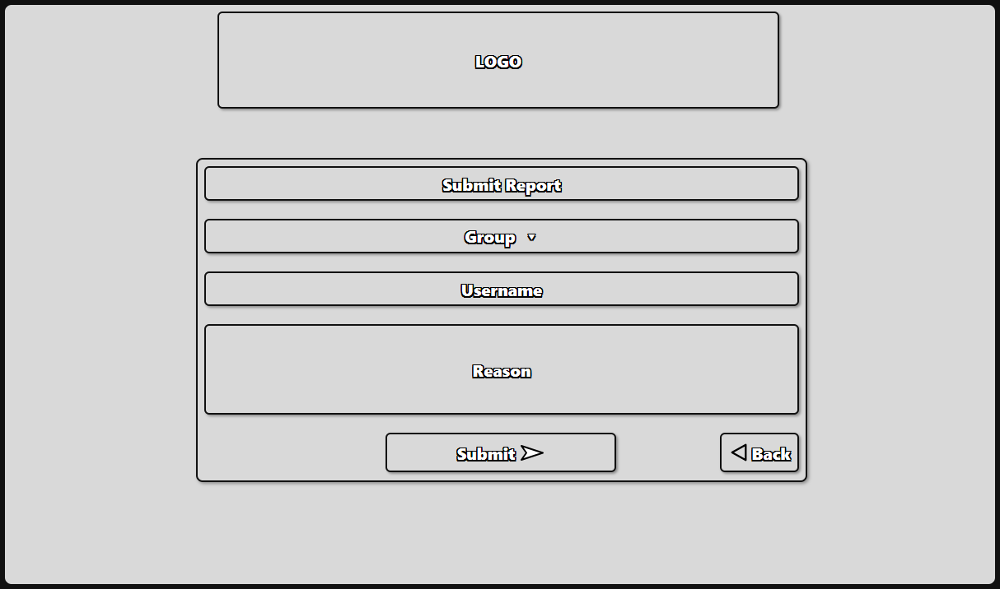
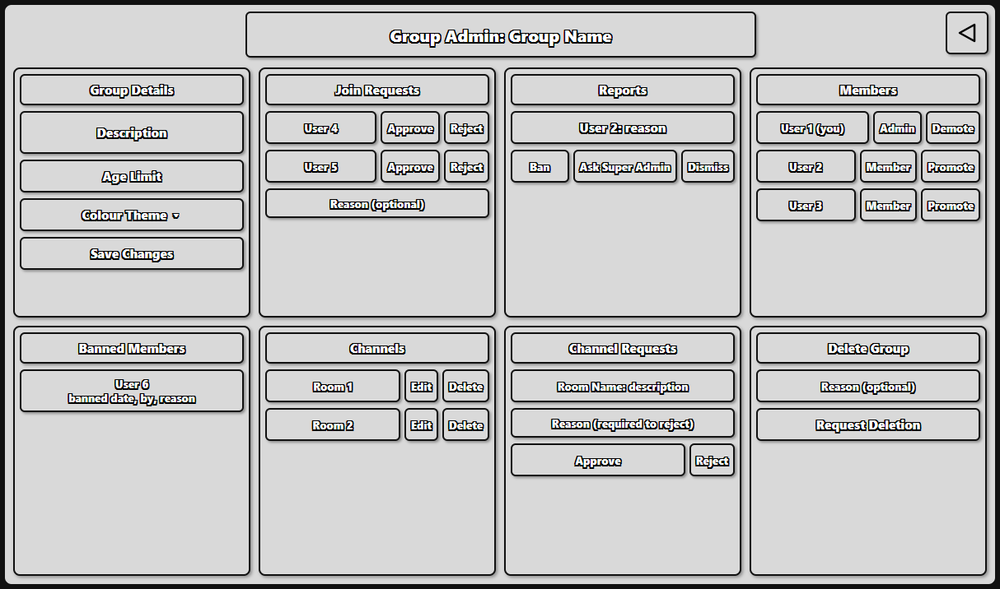
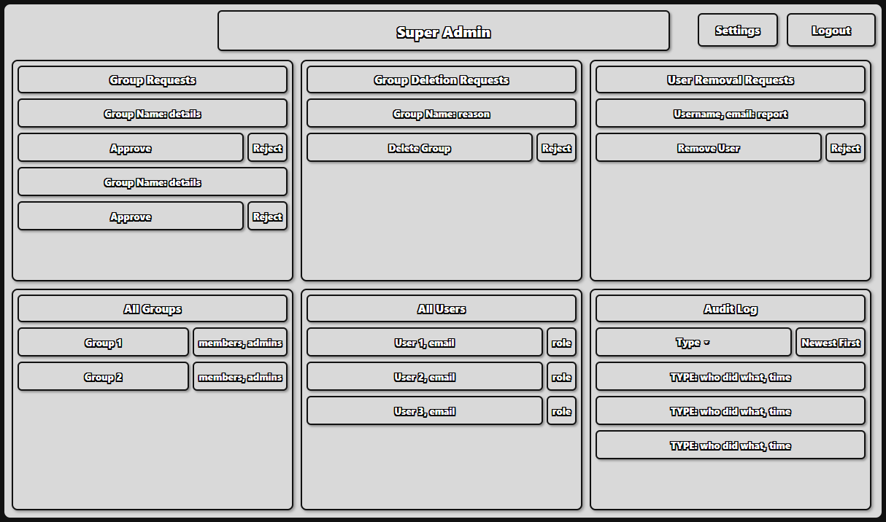
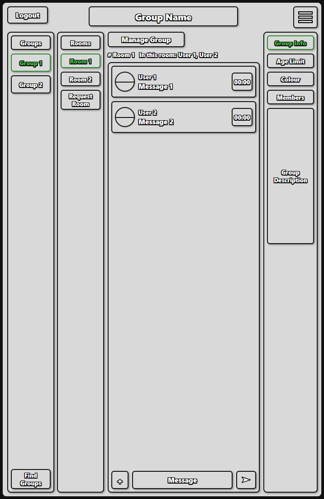

# Lachlan Barnett, s5438449, Thursday 9 to 11

Fabulari is a real-time chat application built on the MEAN stack (MongoDB, Express, Angular and Node.js), with Socket.IO for live communication. Users sign up, browse groups, ask to join them, and chat in each group's rooms with text and PNG images. Group admins manage their groups (members, rooms, join and room requests, reports), and a single super admin approves new groups, group deletions and the removal of users from the system. This document describes the finished Phase 2 application: its requirements, Angular architecture, server API, design and testing.


Phase 2 was developed on a separate `phase2` branch. This kept the `main` branch in a working state while each new item was added, so a working version of the application was always available. Each item on the Phase 2 task list was built, tested and committed on `phase2` before moving on to the next one, so the branch stayed working after every commit as well. When Phase 2 was complete, `phase2` was merged into `develop` and then into `main`, which holds the submitted version.


Commits were kept small, with each one covering a single change such as a new feature, a fix or a test suite, and each commit message gives a short summary of what changed. This means the project history reads as a timeline of how the application was built.


## Specifications and Requirements (Functional Requirements)

The requirements come from the client Q&A and are numbered as in Phase 1 (FR-1 to FR-40). All of them are implemented. The third column describes how each one is met and any assumption made where the specification was unclear.


### System / General

| ID | Functional Requirement | Implementation and Assumptions |
|---|---|---|
| FR-1 | Real-time delivery of messages between users in the same room. | Socket.IO rooms. A new message is broadcast to everyone in the room as `message:new`. |
| FR-2 | Users register their own account with an email, username, date of birth and password. | Email is the unique identifier (MongoDB unique index). There is no OAuth or social sign-up. |
| FR-3 | Passwords are hashed. | bcrypt with 10 salt rounds. Hashes are never sent to the client. |
| FR-4 | Users change their password by entering the old password once and the new password twice. | The server checks that all three fields are given, that the two new passwords match, and the old password against the stored hash. |
| FR-5 | There is no password recovery. | A forgotten password means creating a new account, as stated by the client. |
| FR-6 | Users can switch between light and dark mode. | A personal display setting in Settings, saved in the browser and applied at start-up. |
| FR-7 | Desktop is the main target. Tablet support is a bonus. | Desktop and tablet layouts in portrait and landscape. No mobile app. |
| FR-8 | Users can send PNG images of at most 2MB. | The server checks the PNG file signature (the first 8 bytes), not only the file name, and rejects files over 2MB. |
| FR-9 | Groups have no profile picture. | A group is identified by its name, description and colour theme. |
| FR-10 | Links in messages are plain text, not clickable. | Messages are displayed with Angular text binding, so links and HTML appear as text. |
| FR-11 | Only the 5 most recent messages per room are stored. | Each new message trims the room to its newest 5 and deletes the files of any trimmed images. While in a room a user sees everything from their session. On rejoining they see the stored 5. |


### Users / Members

| ID | Functional Requirement | Implementation and Assumptions |
|---|---|---|
| FR-12 | Users can view all groups. | The Groups page lists every group with its description, age limit and colour, whatever the user's age. |
| FR-13 | Users request to join a group. Requests from users under the age limit are rejected automatically. | The rejection says why. Users banned from a group cannot apply again. |
| FR-14 | Users request a new group, supplying the name, description, age limit and colour theme. | The request goes to the super admin. If approved, the group is created and the requester becomes its first admin. |
| FR-15 | Members propose new rooms. A group admin approves them or rejects them with a reason. | Requests cannot be cancelled once made. |
| FR-16 | A group may have no rooms. | The chat page shows an empty state. |
| FR-17 | Users can see their pending and past rejected requests. | The My Requests page lists pending and rejected group, room and join requests with their reasons. Approved requests simply appear as the new group, room or membership. |
| FR-18 | Users send text and PNG messages in rooms of groups they belong to. | Membership is checked on the server for every join and every message. No voice, GIFs or other file types. |
| FR-19 | Users see who is in the room and are told when someone joins or leaves. | An "In this room" list and "X joined the room" / "X left the room" notices. A user with two tabs open counts once. |
| FR-20 | Users have a private profile with an optional photo. Every field except email can be changed. | The Settings page changes username, birthdate, password and profile photo (PNG, at most 2MB). Profiles are not visible to other users. |
| FR-21 | Messages show a timestamp and the sender's photo. | The server sets the time, and each browser shows it in local time. The sender's current photo is shown, or their initial if they have none. There is no editing, deleting or replying. |
| FR-22 | Users can leave a group at any time. | Leaving does not affect the account, and the user can ask to rejoin. A group's only admin must promote another member first. |


### Group Admin

| ID | Functional Requirement | Implementation and Assumptions |
|---|---|---|
| FR-23 | Group admins edit the group's description, age limit and colour theme. | The name cannot be changed. Colours are limited to the logo colours Blue, Yellow and Red. The age limit is a whole number from 0 to 120. |
| FR-24 | The group's colour theme applies to its rooms. | The chat area is tinted with the group's colour. |
| FR-25 | A user can be admin of any number of groups. | The role is stored on each group membership. |
| FR-26 | Group admins approve room requests, or reject them with a reason. | Admins cannot approve their own requests, as the client ruled out self-approval. |
| FR-27 | Group admins edit a room's name and description. | Room names stay unique within the group, ignoring case. The room keeps its messages. |
| FR-28 | Group admins promote members and demote admins. A group always keeps at least one admin. | Any admin can demote any admin, including themselves, unless they are the last one. |
| FR-29 | Group admins ban users from their group, based on a report. | Members report other members. A group admin reviews each report and bans or dismisses it. Bans are permanent and remove the user from the group. Admins cannot act on reports they filed, and admins must be demoted before they can be banned. |
| FR-30 | Group admins ask the super admin to remove a user from the whole system. | Sent from a report. Only one request per user can be waiting at a time. |
| FR-31 | Group admins ask the super admin to delete their group. | The group is only deleted if the super admin approves. |
| FR-32 | Raising the age limit removes members who are now too young. | Applied straight away. Pending join requests from anyone too young are rejected. The change is refused if it would leave the group with no admin. |
| FR-33 | Group admins see the current and banned members of their group. | Basic details only (username, and for bans the date, the admin and the reason). No emails, and no information about other groups. |
| FR-34 | Group admins are marked in chat. | A green Admin badge on their messages and in the member list. |


### Super Admin

| ID | Functional Requirement | Implementation and Assumptions |
|---|---|---|
| FR-35 | There is exactly one super admin. | Created by the seed script. Sign-up always creates normal users. |
| FR-36 | The super admin approves or rejects requests for new groups. | The super admin never creates groups directly. |
| FR-37 | The super admin approves group deletions requested by a group admin. | Deleting a group removes its rooms, messages, images and pending requests. |
| FR-38 | The super admin removes users from the system at a group admin's request. A removed user's email can never be used again. | The account is deleted, removed from every group, and its email is blocked from signing up again (ignoring case). Refused while the user is the only admin of any group. |
| FR-39 | The super admin has an audit log, filterable by type and in date order. | Every request and decision is recorded with who did it, what happened and when. The log filters by type and shows newest or oldest first. |
| FR-40 | The super admin does not chat. | Blocked on the server, and the super admin's home page is their dashboard instead of chat. |


### Additional Assumptions

| Assumption | Reason |
|---|---|
| Every request carries a login token (JWT), and the server works out who the user is from it. | The server never trusts a user id sent by the client. |
| Only the super admin can list every account. | The client said profiles are private, so other users only ever see usernames. |
| Usernames are not unique. Email is. | Reports find the reported user by username within the chosen group. |
| Group and room names are unique, ignoring case. | Avoids confusing duplicates such as "Gamers" and "gamers". |
| Who is banned from a group is private. | Each user is only told whether they themselves are banned. |
| A removed user's recent messages stay in their rooms until newer messages replace them. | Rooms only keep 5 messages, and removing them early would leave gaps in other people's conversations. |


## Data Structures

Data is stored in MongoDB in a database called `fabulari`. Every document has a numeric `id`, generated from the `counters` collection. MongoDB's internal `_id` is never sent to the client.

| Collection | Fields |
|---|---|
| `users` | `id`, `email` (unique), `username`, `birthdate`, `passwordHash`, `role` ("user" or "superadmin"), `profilePhoto` |
| `groups` | `id`, `name`, `description`, `ageLimit`, `colourTheme`, `members` (list of `{ userId, role }`), `bannedUserIds` |
| `rooms` | `id`, `groupId`, `name`, `description`, `createdAt` |
| `messages` | `id`, `roomId`, `senderId`, `senderName`, `type` ("text" or "image"), `content`, `timestamp`. At most 5 per room. |
| `joinRequests` | `id`, `groupId`, `userId`, `status`, `rejectionReason`, `reviewedBy`, `createdAt` |
| `groupRequests` | `id`, `requestedBy`, `name`, `description`, `ageLimit`, `colourTheme`, `status`, `rejectionReason`, `reviewedBy`, `createdAt` |
| `roomRequests` | `id`, `groupId`, `requestedBy`, `name`, `description`, `status`, `rejectionReason`, `reviewedBy`, `createdAt` |
| `groupDeleteRequests` | `id`, `groupId`, `groupName`, `requestedBy`, `reason`, `status`, `rejectionReason`, `reviewedBy`, `createdAt` |
| `reports` | `id`, `reportedUserId`, `reportedBy`, `groupId`, `reason`, `status` (pending, actioned, dismissed or escalated), `reviewedBy`, `createdAt` |
| `bans` | `id`, `userId`, `scope` ("group" or "system"), `groupId`, `reportId`, `issuedBy`, `createdAt` |
| `systemBanRequests` | `id`, `userId`, `username`, `email`, `groupId`, `groupName`, `reportId`, `reason`, `requestedBy`, `status`, `rejectionReason`, `reviewedBy`, `createdAt` |
| `bannedEmails` | `email` (unique, ignoring case), `userId`, `bannedAt` |
| `auditLog` | `id`, `type`, `actorId`, `actorName`, `targetType`, `targetId`, `details`, `timestamp` |
| `counters` | `_id` (collection name), `seq` |

Request `status` is always "pending", "approved" or "rejected".


## Angular Architecture

The client is an Angular 22 app built from standalone components. Each feature has its own folder, and communication with the server goes through HTTP for normal requests and Socket.IO for live chat. Component state is held in signals, and the socket service exposes Observables that the chat page turns into signals.


### Models

TypeScript interfaces in `src/app/models`, used across services and components.

| Model | Fields / Purpose |
|---|---|
| `User` | `id, email, username, birthdate, role, profilePhoto`. The logged-in user. |
| `Group`, `GroupMember` | A group and its members (`userId, role`), plus `isBanned` for the logged-in user. |
| `GroupMemberDetails` | A member with their `username`, for member lists. |
| `BannedMember` | `userId, username, bannedAt, bannedByName, reason`, for the banned members list. |
| `Room` | `id, groupId, name, description, createdAt` |
| `Message`, `MessageType` | `id, roomId, senderId, senderName, senderPhoto, type, content, timestamp`. The type is "text" or "image". |
| `PresentUser`, `PresenceEvent` | A user in a room, and a "joined" or "left" notice. |
| `JoinRequest`, `GroupRequest`, `RoomRequest`, `GroupDeleteRequest`, `SystemBanRequest`, `RequestStatus` | The request types. All share `id, status, rejectionReason, reviewedBy, createdAt`, where the status is "pending", "approved" or "rejected". |
| `Report` | `id, reportedUserId, reportedBy, groupId, reason, status, reviewedBy, createdAt`, plus names for admins. |
| `AuditLogEntry` | `id, type, actorId, actorName, targetType, targetId, details, timestamp` |
| `ColourTheme`, `COLOUR_THEMES`, `THEME_TINTS` | The allowed colours (Blue, Yellow and Red) and the tint each one gives the chat area. |


### Services

| Service | Responsibility |
|---|---|
| `AuthService` | Login, sign-up and logout. Holds the logged-in user and their token, updates the user after profile changes, and gives each role's home page. |
| `authInterceptor` | Adds the login token to every HTTP request, and logs the user out if the server rejects it. |
| `ChatSocketService` | Wraps the Socket.IO connection: connect, join and leave rooms, send messages, and streams of new messages, presence updates and join/leave notices. Disconnects on logout. |

`src/app/api.config.ts` holds the server address used by the services.


### Components

| Component | Purpose |
|---|---|
| `Login` | Email and password login. Sends the user to chat, or the super admin to their dashboard. |
| `Signup` | Registration form (email, username, date of birth, password). |
| `Chat` | The main page: groups and rooms, live messages with timestamps, photos and Admin badges, who is in the room, join/leave notices, the message box with image upload, the Request room form, and the group information panel. |
| `Groups` | All groups with Apply, Pending, Member, Admin or Banned state, the Leave button, and the Request a new group form. |
| `MyRequests` | The user's pending and rejected requests. |
| `Settings` | Profile photo, profile details, dark mode, and links to change password, username and birthdate, My Requests and Submit Report. |
| `ChangePassword` | Current password, then the new password twice. |
| `ChangeUsername` | New username. |
| `ChangeBirthdate` | New date of birth. |
| `Report` | Report a member of one of your groups. |
| `GroupAdminDashboard` | Group details, join requests, reports, members (promote and demote), banned members, channels (edit and delete), channel requests and group deletion. |
| `SuperAdminDashboard` | Group requests, group deletion requests, user removal requests, all groups, all users and the audit log. |


### Routes

| Path | Component | Guard | Notes |
|---|---|---|---|
| / | Login | guestGuard | Logged-in users go to their home page. |
| /signup | Signup | guestGuard | Logged-in users go to their home page. |
| /chat | Chat | authGuard, notSuperAdminGuard | Home page for users. |
| /groups | Groups | authGuard, notSuperAdminGuard | |
| /requests | MyRequests | authGuard, notSuperAdminGuard | |
| /settings | Settings | authGuard | |
| /change-password | ChangePassword | authGuard | |
| /change-username | ChangeUsername | authGuard | |
| /change-birthdate | ChangeBirthdate | authGuard | |
| /report | Report | authGuard | |
| /admin/group/:groupId | GroupAdminDashboard | authGuard, groupAdminGuard | Only admins of that group, checked with the server each time. |
| /admin/super | SuperAdminDashboard | authGuard, superAdminGuard | Home page for the super admin. |


## Server Endpoints

The server is Node.js with Express and Socket.IO, on port 3000. All REST endpoints start with `/api` and use JSON unless noted. Errors are returned as `{ "message": "..." }`.

Login and sign-up return a token. Every other endpoint needs the header `Authorization: Bearer <token>`, and returns `401` without a valid one. Access levels used below:

| Access | Meaning |
|---|---|
| Public | No token needed. |
| User | Any logged-in user. |
| Self | Only the user named in the URL. |
| Member | A member of the group in the URL. |
| Group admin | An admin of the group in the URL. |
| Super admin | The super admin only. |

Common error codes: `400` invalid input, `401` not logged in, `403` not allowed, `404` not found, `409` conflict (a duplicate, or already actioned), `413` file too large.


### Auth

| Method | Endpoint | Description | Access |
|---|---|---|---|
| POST | /api/auth | Log in with `{ email, password }`. Returns `{ valid: true, token, id, email, username, birthdate, role, profilePhoto }`, or `{ valid: false }` for wrong details. | Public |
| POST | /api/signup | Register with `{ email, username, birthdate, password }`. Returns the same as login. `403` if the email has been banned, `409` if it is already registered. | Public |


### Users

| Method | Endpoint | Description | Access |
|---|---|---|---|
| GET | /api/users | List every account (no password hashes). | Super admin |
| PUT | /api/users/:userId | Change `{ username, birthdate }`. Returns the updated user. | Self |
| PUT | /api/users/:userId/password | Change password with `{ currentPassword, newPassword, confirmPassword }`. `400` if the new passwords don't match, `403` if the current password is wrong. | Self |
| PUT | /api/users/:userId/photo | Upload a profile photo as form data, field `image` (PNG, at most 2MB). Returns the user with `profilePhoto`. | Self |
| DELETE | /api/users/:userId/photo | Remove the profile photo. | Self |


### Groups

| Method | Endpoint | Description | Access |
|---|---|---|---|
| GET | /api/groups | List all groups, each with `members` and `isBanned` (whether you are banned). | User |
| GET | /api/groups/:groupId | One group. | User |
| PUT | /api/groups/:groupId | Change `{ description, ageLimit, colourTheme }`. Returns the group and `removedMembers` (members removed by a higher age limit). `409` if no admin would be left. | Group admin |
| GET | /api/groups/:groupId/members | Members with `userId, role, username`. | Member |
| DELETE | /api/groups/:groupId/membership | Leave the group. `409` if you are its only admin. | Member |
| PUT | /api/groups/:groupId/members/:userId/role | Set `{ role: "admin" or "member" }`. `409` if no admin would be left. | Group admin |


### Join Requests

| Method | Endpoint | Description | Access |
|---|---|---|---|
| POST | /api/groups/:groupId/join-requests | Ask to join. Rejected straight away if under the age limit. `403` if banned, `409` if already a member or already waiting. | User (not super admin) |
| GET | /api/join-requests/mine | Your join requests. | User |
| GET | /api/groups/:groupId/join-requests | Pending join requests with usernames. | Group admin |
| PUT | /api/groups/:groupId/join-requests/:requestId | Decide with `{ approve, reason }`. Approving adds the member after checking the age limit again. | Group admin |


### Group Requests

| Method | Endpoint | Description | Access |
|---|---|---|---|
| POST | /api/group-requests | Ask for a new group with `{ name, description, ageLimit, colourTheme }`. `409` if the name exists or is already requested. | User (not super admin) |
| GET | /api/group-requests/mine | Your group requests. | User |
| GET | /api/admin/group-requests | Pending group requests with the requester's name. | Super admin |
| PUT | /api/admin/group-requests/:requestId | Decide with `{ approve, reason }`. Approving creates the group with the requester as admin. | Super admin |


### Rooms

| Method | Endpoint | Description | Access |
|---|---|---|---|
| GET | /api/groups/:groupId/rooms | The group's rooms. | Member |
| PUT | /api/groups/:groupId/rooms/:roomId | Change `{ name, description }`. `409` if another room has that name. | Group admin |
| DELETE | /api/groups/:groupId/rooms/:roomId | Delete a room with its messages and images. | Group admin |
| POST | /api/groups/:groupId/room-requests | Ask for a new room with `{ name, description }`. | Member |
| GET | /api/room-requests/mine | Your room requests. | User |
| GET | /api/groups/:groupId/room-requests | Pending room requests with the requester's name. | Group admin |
| PUT | /api/groups/:groupId/room-requests/:requestId | Decide with `{ approve, reason }`. Rejecting needs a reason. Approving creates the room. `403` for your own request. | Group admin |


### Messages

| Method | Endpoint | Description | Access |
|---|---|---|---|
| POST | /api/rooms/:roomId/images | Upload an image as form data, field `image` (PNG, at most 2MB). Returns `{ url }`, which is then sent with `message:send`. | Member of the room's group |

Uploaded files are served from `/uploads`. Message history is returned by the `room:join` socket event.


### Reports and Bans

| Method | Endpoint | Description | Access |
|---|---|---|---|
| POST | /api/reports | Report a member with `{ groupId, username, reason }`. Both users must be in the group. | User |
| GET | /api/groups/:groupId/reports | Pending reports with the reporter's and reported user's names. | Group admin |
| PUT | /api/groups/:groupId/reports/:reportId | Act with `{ action: "ban" or "dismiss" }`. Banning removes the member and records the ban. `403` for your own report, `409` if the user is an admin. | Group admin |
| POST | /api/groups/:groupId/reports/:reportId/escalate | Ask the super admin to remove the reported user from Fabulari. | Group admin |
| GET | /api/groups/:groupId/banned | Users banned from the group, with when, by whom and why. | Group admin |


### Group Deletion

| Method | Endpoint | Description | Access |
|---|---|---|---|
| POST | /api/groups/:groupId/delete-requests | Ask for the group to be deleted with `{ reason }`. `409` if a request is already waiting. | Group admin |
| GET | /api/groups/:groupId/delete-requests | This group's deletion requests. | Group admin |
| GET | /api/admin/group-delete-requests | Pending deletion requests. | Super admin |
| PUT | /api/admin/group-delete-requests/:requestId | Decide with `{ approve, reason }`. Approving deletes the group and everything in it. | Super admin |


### Super Admin

| Method | Endpoint | Description | Access |
|---|---|---|---|
| GET | /api/admin/system-ban-requests | Pending requests to remove users from Fabulari. | Super admin |
| PUT | /api/admin/system-ban-requests/:requestId | Decide with `{ approve, reason }`. Approving deletes the account and bans the email. `409` if the user is the only admin of a group. | Super admin |
| GET | /api/admin/audit-log | The audit log. `?type=` filters by type, `?order=oldest` shows oldest first (newest first by default). Returns `{ types, entries }`. | Super admin |

The audit log records these types: `USER_SIGNED_UP`, `JOIN_REQUESTED`, `JOIN_AUTO_REJECTED`, `JOIN_APPROVED`, `JOIN_REJECTED`, `GROUP_REQUESTED`, `GROUP_CREATED`, `GROUP_REQUEST_REJECTED`, `GROUP_UPDATED`, `MEMBERS_REMOVED_AGE_LIMIT`, `GROUP_LEFT`, `MEMBER_PROMOTED`, `ADMIN_DEMOTED`, `ROOM_REQUESTED`, `ROOM_CREATED`, `ROOM_REJECTED`, `ROOM_UPDATED`, `ROOM_DELETED`, `REPORT_FILED`, `USER_BANNED_FROM_GROUP`, `REPORT_DISMISSED`, `REMOVAL_REQUESTED`, `USER_REMOVED`, `REMOVAL_REJECTED`, `GROUP_DELETE_REQUESTED`, `GROUP_DELETED` and `GROUP_DELETE_REJECTED`.


### WebSocket Events

Sockets connect with `{ auth: { token } }`, and connections without a valid token are refused. Events sent by the client receive a reply of `{ ok: true, ... }` or `{ ok: false, message }`.

| Event | Direction | Description |
|---|---|---|
| room:join | Client → Server | Join a room with `{ roomId }`. Replies with the last 5 messages and who is present. Members only, and not the super admin. |
| room:leave | Client → Server | Leave a room. |
| message:send | Client → Server | Send `{ roomId, type, content }`. Text is 1 to 2000 characters. An image is a path returned by the upload endpoint. |
| message:new | Server → Client | A new message, sent to everyone in the room. |
| presence:update | Server → Client | The list of who is in the room. |
| presence:joined | Server → Client | Someone joined the room. |
| presence:left | Server → Client | Someone left the room or disconnected. |


## Design Documents (Wireframes)

Pages that are unchanged from Phase 1 keep their Phase 1 wireframes. Pages that changed in Phase 2 have updated wireframes, and new pages have new wireframes drawn in the same style.


### 1. Login


This is the login page, where the user enters their email and password. Users go to the chat page after logging in, and the super admin goes to their dashboard. A Show password checkbox reveals the password, and the Signup button goes to the registration page.


### 2. Signup


This is the signup page, where a new user enters their email, username, date of birth and password (FR-2). The date of birth is used to check group age limits (FR-13), and the password is hashed on the server (FR-3).


### 3. Chat



This is the chat page, where users spend most of their time. Groups and rooms are on the left, with a Find Groups button and a Request room button (FR-15). The middle shows the current room's name and who is in it (FR-19), then the messages, each with the sender's photo, name, an Admin badge for group admins and the time (FR-21, FR-34). Join and leave notices appear between messages. At the bottom are the message box and the + button for sending a PNG image (FR-8, FR-18). The group information panel on the right shows the group's description, age limit, colour and members. Group admins see a Manage Group button that opens their dashboard.

The Request room button opens a short form above the messages (room name and description), which sends the request to the group's admins.


### 4. Groups



This is the groups page, which lists every group in the system (FR-12). Each group shows the user's state: Apply, Pending, Member, Admin, or Banned, with the reason for any rejection (FR-13). Groups the user belongs to have a Leave button (FR-22). A Request a new group form sends a request to the super admin (FR-14), and a link opens My Requests.


### 5. My Requests



This page lists the user's pending and rejected requests to join groups, create groups and create rooms, with the reason for each rejection (FR-17).


### 6. Settings



This is the settings page. The Profile panel shows the user's photo, with buttons to add, change or remove it, and their email, username and birthdate (FR-20). The Settings panel has the dark mode switch (FR-6) and links to change the password, username and birthdate, view My Requests, and submit a report.


### 7. Change Password


This is the change password page. The user enters their current password once and the new password twice, and the server checks both before saving (FR-4). Each field has its own Show password checkbox.


### 8. Change Username and Change Birthdate


This is the change username page (FR-20).



The change birthdate page follows the same layout and is reached from Settings. The new date of birth is used for group age limits (FR-13, FR-32).


### 9. Submit Report



This page lets a user report another member of one of their groups, choosing the group and giving the username and a reason. The report goes to that group's admins (FR-29).


### 10. Group Admin Dashboard



This page is only open to the group's admins. It has panels for the group's details (FR-23, FR-32), join requests, reports with Ban, Ask super admin to remove and Dismiss buttons (FR-29, FR-30), members with Promote and Demote buttons (FR-28), banned members (FR-33), channels with Edit and Delete buttons (FR-27), channel requests (FR-26), and requesting the group's deletion (FR-31).


### 11. Super Admin Dashboard



This page is the super admin's home page. It has panels for group requests (FR-36), group deletion requests (FR-37), user removal requests (FR-38), all groups, all users, and the audit log with a type filter and newest or oldest first ordering (FR-39).


### Responsiveness

Desktop is the main target and tablets are supported (FR-7). The chat page fills the screen height, the group and room columns scroll on their own, and the message list takes the remaining space, so the message box always stays on screen. Below 900px wide the side columns narrow, and below 740px the Settings panels stack. The layout was checked at laptop sizes and on iPad sizes in portrait and landscape.



On a tablet in portrait, the chat page keeps the same columns at a narrower width, and the message list grows to fill the taller screen.


### Accessibility

Every page was checked with axe-core against the WCAG 2.1 A and AA rules, in both light and dark mode, with no violations. Every form field has a label, icon-only buttons have names that screen readers can read, new messages and errors are announced, keyboard focus is clearly visible, and colours meet the AA contrast level in both modes. Actions that delete or remove something ask for confirmation first.


## Testing

### Tools and Methodology

| Level | Tools | What it covers |
|---|---|---|
| Unit and component tests | Vitest through Angular's unit-test builder, with Angular TestBed and a fake HTTP backend | Each component shows the right content and sends the right requests, the route guards allow and redirect correctly, and the socket service handles events (using a fake socket). No server is needed. |
| Server API and socket tests | Node's built-in test runner (`node:test`) with `assert`, `fetch` and `socket.io-client` | Each test file starts the real server against a separate test database (`fabulari_test`) and uploads folder, reset before every scenario. The tests call the real endpoints and socket events and check status codes, responses, database contents and files on disk. |
| End-to-end tests | Cypress | Real user flows through the running app in a browser. |

Every change was checked with the unit tests and a production build, and every server change with the server test suite. To run the tests:

```bash
cd Fabulari && npx ng test --watch=false   # Angular unit tests
cd Fabulari/server && npm test              # server API and socket tests (MongoDB must be running)
```


### Automated Unit Tests (118 tests)

| Area | File | Tests |
|---|---|---|
| App | `app.spec.ts` | Creates the app · shows the logo · applies saved dark mode on start-up · uses light mode by default |
| Chat | `chat.spec.ts` | Joins the first room and shows who is present · shows history · shows live messages with an Admin badge · shows the sender's photo or initial · shows join and leave notices · sends a message and clears the box · shows send errors and keeps the text · uploads a PNG and sends it · refuses non-PNG files · refuses images over 2MB · shows upload errors · shows image messages · opens the Request room form · sends a room request · needs a room name · shows room request errors · leaves the old room when switching · leaves the room when the page closes |
| Chat socket service | `chat-socket.service.spec.ts` | Connects with the login token · opens only one connection · does not connect when logged out · join returns history and who is present · a refused join fails · send returns the stored message · leaves rooms · passes on new messages · passes on join and leave notices · disconnects on logout |
| Groups | `groups.spec.ts` | Shows Admin, Pending, rejected and Apply states · shows Banned with no Apply button · shows Leave only on your groups · leaves after confirming · does nothing if cancelled · explains why the only admin cannot leave · sends a join request · new group form has labelled fields and the three colours · sends a group request and clears the form · needs a name · rejects a bad age limit · shows server errors |
| My Requests | `my-requests.spec.ts` | Lists pending requests with group names · lists rejected requests with reasons · leaves approved requests out · shows an error if loading fails |
| Settings | `settings.spec.ts` | Back arrow goes to the user's home page · shows profile details · shows the initial and Add photo · uploads a photo · rejects non-PNG and oversized photos · removes the photo · shows upload errors |
| Group admin dashboard | `group-admin-dashboard.spec.ts` | Warns about the age limit · saves and names removed members · says Saved when nobody was removed · leaves the dashboard if the admin removed themselves · shows the "no admin" error · lists join requests · approves and rejects join requests · shows join errors · lists reports · bans after confirming · asks the super admin to remove a user · dismisses reports · cannot act on your own report · edits channels · asks before deleting a channel · cannot approve your own channel request · needs a reason to reject a channel request · requests group deletion · shows pending and rejected deletion requests · lists banned members · gets member names without the full user list · marks you and protects the only admin |
| Super admin dashboard | `super-admin-dashboard.spec.ts` | Lists and approves group requests · lists, approves and rejects deletion requests · lists and approves user removals · shows the "only admin" error · lists the audit log · filters by type · switches newest and oldest first · refreshes after each action |
| Guards | `group-admin.guard.spec.ts`, `not-super-admin.guard.spec.ts` | Group admins allowed · members, missing groups and logged-out users redirected · normal users allowed · super admin sent to the dashboard |
| Change password | `change-password.spec.ts` | Every field has a unique id and label · each Show checkbox reveals only its own field |
| Other pages | `login`, `signup`, `report`, `change-username`, `change-birthdate` | Each page is created |


### Automated Server Tests (425 checks in 21 scenarios)

The tests are in `Fabulari/server/test/`, and every check is reported by name when they run.

| File | Scenario | Checks |
|---|---|---|
| `auth-and-users.test.js` | Login, sign-up and password hashing | 18 |
| | Changing password | 7 |
| | Login tokens and access control | 12 |
| `requests-and-roles.test.js` | Join requests and the age limit | 14 |
| | New group requests | 18 |
| | Room requests and deleting rooms | 20 |
| | Promoting and demoting admins | 6 |
| | Filing reports | 4 |
| `chat-sockets.test.js` | Socket connections, rooms, presence and messages | 29 |
| | Only the last 5 messages per room are kept | 12 |
| | The super admin does not chat | 7 |
| `images-and-photos.test.js` | Image messages (PNG only, at most 2MB) | 27 |
| | Profile photos | 24 |
| `moderation.test.js` | Group deletion requests | 28 |
| | Reports and group bans | 32 |
| | Banned members list | 16 |
| | Removing a user from Fabulari | 42 |
| `group-admin.test.js` | Raising the age limit removes under-age members | 33 |
| | Audit log | 43 |
| | Leaving a group | 16 |
| | Editing a room | 17 |


### End-to-End Tests (Cypress)

| Test | Covers |
|---|---|
| | |
