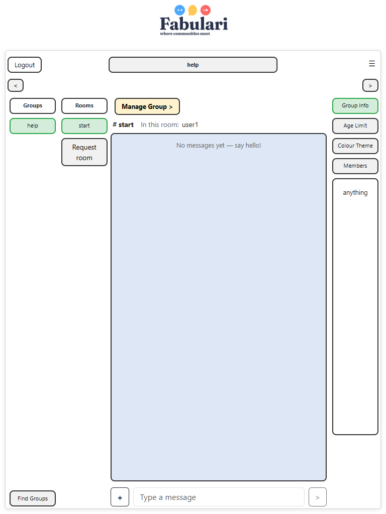

# Lachlan Barnett, s5438449, Thursday 9 to 11

# Fabulari Phase 2

Fabulari is a real-time chat application built on the MEAN stack (MongoDB, Express, Angular, Node.js) with Socket.IO for live communication. Users sign up, browse groups, ask to join them, and chat in the group's rooms with text and PNG images. Group admins run their groups (members, rooms, join and room requests), and a single super admin approves new groups, group deletions and system-wide bans.

Phase 1 produced the specification, design and a prototype backed by a JSON file. Phase 2 turns that into the full application: MongoDB storage, hashed passwords and token authentication, real-time chat over sockets, image uploads, and the request/approval workflows described by the client.

> **Status** used below: **Done** or **To do**. All 40 requirements are implemented. The only item still to do is the Cypress end-to-end test suite.

## Contents

1. [Running the application](#running-the-application)
2. [Git workflow](#git-workflow)
3. [Specifications and requirements](#1-specifications-and-requirements)
4. [Server API documentation](#2-server-api-documentation)
5. [Angular architecture](#3-angular-components-services-and-models)
6. [Design documents](#4-design-documents)
7. [Testing](#5-testing)
8. [Changes from Phase 1](#changes-from-phase-1)

---

## Running the application

**Requirements:** Node.js, npm, and MongoDB running locally on the default port (`mongodb://127.0.0.1:27017`).

```bash
# 1. Server (Express + Socket.IO, port 3000)
cd Fabulari/server
npm install
npm run seed      # creates the "fabulari" database with demo data (wipes it first)
npm start         # runs listen.js

# 2. Client (Angular, port 4200), in a second terminal
cd Fabulari
npm install
npx ng serve      # then open http://localhost:4200
```

**Demo accounts** (all passwords are `123`):

| Email | Role |
|---|---|
| `admin@test.com` | Super admin |
| `user1@com.au` | User, admin of the "help" group |
| `user2@com.au` | User, member of the "help" group |

**Configuration** (optional environment variables for the server): `MONGO_URL`, `DB_NAME` (default `fabulari`), `PORT` (default `3000`), `JWT_SECRET` (a development default is used if unset).

**Tests** (see [Testing](#5-testing)):

```bash
cd Fabulari && npx ng test --watch=false   # Angular unit tests
cd Fabulari/server && npm test              # server API + socket tests (needs MongoDB running)
```

The server tests use their own database (`fabulari_test`) and uploads folder (`server/test-uploads`), so they never touch the demo data.

---

## Git workflow

The repository follows the GitFlow-style strategy set out in Phase 1: `main` holds the submitted state, `develop` is the integration branch, and work happens on feature/phase branches (`phase1`, `phase2`) that are merged back. Phase 2 was built on the `phase2` branch as a series of small commits, one per logical change (a feature, a fix, or a refactor), so the history reads as a timeline of the build. Commit messages are short imperative summaries, e.g. *"Store the last 5 messages per room and send them as history on join"*.

---

## 1. Specifications and Requirements

The requirements come from the client Q&A (see `3813ICT Assignment Specifications.txt`) and are numbered as in Phase 1 (FR-1 to FR-40) so they can be compared directly. The **Implementation** column describes how Phase 2 meets each one.

### System / General

| ID | Requirement | Status | Implementation |
|---|---|---|---|
| FR-1 | Real-time delivery of messages between users in the same room. | Done | Socket.IO rooms (`room:<id>`). `message:new` is broadcast to everyone in the room. |
| FR-2 | Users register their own account (email, username, date of birth, password). | Done | `POST /api/signup`. Email is unique (MongoDB unique index). |
| FR-3 | Passwords are hashed. | Done | bcrypt (`bcryptjs`, 10 salt rounds). Hashes are never sent to the client. |
| FR-4 | Change password: old password once, new password twice, checked on the server. | Done | The server checks all three fields, that the two new passwords match, and the old password against the hash. |
| FR-5 | No password recovery. A forgotten password means a new account. | Done | By design. No recovery endpoint. |
| FR-6 | Light / dark mode. | Done | Toggle in Settings. Saved in the browser and applied at start-up. |
| FR-7 | Desktop first. Tablet is a bonus. | Done | Desktop and tablet (portrait and landscape) layouts, checked in a browser at five screen sizes during development. |
| FR-8 | PNG image messages, max 2MB. | Done | Upload endpoint checks the PNG file signature (first 8 bytes), not just the name, and rejects files over 2MB. |
| FR-9 | Groups have no profile picture. | Done | Identity is name, description and colour theme. |
| FR-10 | Links are shown as plain text, never as clickable links. | Done | Messages are rendered with Angular text interpolation, so HTML and URLs are displayed as text. |
| FR-11 | Only the 5 most recent messages per room are stored. | Done | Each new message trims the room to its newest 5 (and deletes files of trimmed images). While in a room you see everything from your session. Rejoining shows the stored 5. |

### Users / Members

| ID | Requirement | Status | Implementation |
|---|---|---|---|
| FR-12 | Users can see all groups. | Done | Groups page lists every group with its description, age limit and theme. |
| FR-13 | Users request to join. Under-age requests are rejected automatically. | Done | Join requests are auto-rejected with a reason when the user is under the group's age limit. Otherwise a group admin approves. Users banned from the group can't apply again. |
| FR-14 | Users request a new group, supplying name, description, age limit and colour. | Done | "Request a new group" form on the Groups page → super admin. The requester becomes the new group's first admin. |
| FR-15 | Members propose rooms. An admin approves or rejects with a reason. | Done | "Request room" form on the chat page. Requests can't be cancelled. |
| FR-16 | A group may have no rooms. | Done | Empty states throughout the chat page. |
| FR-17 | Users see their pending and past-rejected requests. | Done | **My Requests** page (`/requests`) lists pending and rejected group, room and join requests with reasons. |
| FR-18 | Users send text and PNG messages in rooms they belong to. | Done | Membership is checked on the server for every join and every message. |
| FR-19 | Users see who is in the room and get join/leave notifications. | Done | "In this room" list and "X joined / X left the room" notices. A user with two tabs open counts once. |
| FR-20 | Private profile page with an optional photo. Everything but email is editable. | Done | Settings page: change username, birthdate, password, and profile photo (PNG, 2MB). |
| FR-21 | Messages show a timestamp and the sender's photo. | Done | Server timestamp shown in the viewer's local time. Sender's current photo (or initial). |
| FR-22 | Users can leave a group. | Done | **Leave** button (with confirmation) on the Groups page for groups you belong to. Leaving doesn't affect your account, and you can ask to rejoin. A group's only admin can't leave until another admin is promoted (or the group is deleted). |

### Group Admin

| ID | Requirement | Status | Implementation |
|---|---|---|---|
| FR-23 | Edit description, age limit and colour theme (not the name). | Done | Group admin dashboard. Colour theme is limited to the logo colours: Blue, Yellow, Red. |
| FR-24 | The group's colour theme applies to its rooms. | Done | The chat area is tinted with the group's colour. |
| FR-25 | No limit on how many groups a user can administer. | Done | Role is stored per group membership. |
| FR-26 | Approve or reject room requests, with a reason for rejections. | Done | Admins can't approve their own requests (client: no self-approval). |
| FR-27 | Edit a room's name and description. | Done | **Edit** button on each channel in the dashboard opens an inline form. Names stay unique in the group (ignoring case). The room keeps its messages. |
| FR-28 | Promote members. Demote admins. A group always keeps one admin. | Done | Any admin can demote any admin, including themselves, unless they are the last one. |
| FR-29 | Ban a user from the group, based on a report. | Done | Members file reports (Settings → Submit Report). Group admins review them in the **Reports** panel: **Ban from group** (permanent, removes the member, records a ban, rejects any pending join request) or **Dismiss**. Admins can't act on reports they filed, and admins can't be banned (demote first). Banned users see a **Banned** badge on the Groups page. |
| FR-30 | Ask the super admin to remove a user from the whole system. | Done | From a report: **Ask super admin to remove from Fabulari** sends a removal request (the report becomes `escalated`). One pending request per user. Not for your own reports or the super admin. |
| FR-31 | Ask the super admin to delete the group. | Done | "Delete Group" panel → super admin approves or rejects. |
| FR-32 | Raising the age limit removes members who are now too young. | Done | Saving a higher age limit removes every member under it (birthdates stay private, the server works it out) and rejects pending join requests from anyone too young. The dashboard warns beforehand and names who was removed afterwards. Refused if it would leave the group with no admin. |
| FR-33 | See current and banned members of their group. | Done | Dashboard **Members** and **Banned Members** panels. The banned list shows username, date, who banned them and the report's reason. Basic details only, no emails. Group bans are permanent, so there is no unban. |
| FR-34 | Admins are marked in chat. | Done | Green **Admin** badge on messages and in the member list. |

### Super Admin

| ID | Requirement | Status | Implementation |
|---|---|---|---|
| FR-35 | Exactly one super admin. | Done | Seeded. Signup always creates normal users. |
| FR-36 | Super admin approves or rejects group requests. Never creates groups directly. | Done | The direct "create group" route from Phase 1 was removed. |
| FR-37 | Super admin approves group deletions requested by a group admin. | Done | Approval removes the group with its rooms, messages, images and pending requests. |
| FR-38 | Super admin bans/deletes users at a group admin's request. Banned emails can't be reused. | Done | **User Removal Requests** panel. Approving deletes the account, removes it from every group, deletes its photo and pending requests, records a system ban and blocks the email (case-insensitive) from signing up again. Refused while the user is the only admin of any group, another admin must be promoted first. |
| FR-39 | Audit log, filterable by type, in date order. | Done | Every request and decision is recorded (27 kinds of event, see [Audit log types](#audit-log-types)). The super admin's **Audit Log** panel filters by type and switches between newest and oldest first. Names are stored with each entry, so the log still reads correctly after an account or group is deleted. |
| FR-40 | The super admin does not chat. | Done | Blocked on the server (join requests and socket events) and in the UI (the super admin lands on their dashboard). |

### Other decisions

| Decision | Reason |
|---|---|
| Users are identified by a login token (JWT) sent with every request and socket connection. | The server never trusts user ids sent by the client. |
| When a raised age limit catches an admin, they are removed like anyone else, unless no admin would be left, in which case the change is refused. | Applies the client's rule fairly while keeping the "always one admin" rule. |
| Admins can't be banned from their group. They must be demoted first. | Keeps the "always one admin" rule safe and makes removing an admin a deliberate two-step action. |
| A removed user's last messages stay in their rooms (still under their name) until pushed out by newer ones. | Rooms only keep 5 messages, so they disappear naturally. Deleting them early would leave gaps in other people's conversations. |
| Profiles are private: only the super admin can list every account and email. | Group admins and members only ever see usernames and roles, matching the client's "profiles are private". |
| Who is banned from a group is private. | Group lists only tell each user whether *they* are banned (`isBanned`). |
| Usernames aren't unique. Email is. | Reports find the reported user by username *within the chosen group*. |
| Group and room names are unique (ignoring case). | Avoids confusing duplicates like "Gamers" and "gamers". |
| Message timestamps come from the server. | One source of truth. Each browser shows it in local time. |
| Uploaded files get random names and are served with `nosniff`. | Unguessable addresses. Browsers can't treat an upload as anything but a PNG. |

---

## 2. Server API Documentation

**Base URL:** `http://localhost:3000/api`. All request and response bodies are JSON unless noted. Error responses have the form `{ "message": "..." }`.

**Authentication.** `POST /auth` and `POST /signup` return a `token`. Every other endpoint needs the header `Authorization: Bearer <token>`. Without a valid token the response is `401`. Access levels below:

| Access | Meaning |
|---|---|
| Public | No token needed. |
| User | Any logged-in user. |
| Self | Only the user named in the URL (`:userId` must be your own id). |
| Member | A member of the group in the URL. |
| Group admin | An admin of the group in the URL. |
| Super admin | The super admin only. |

Common errors: `400` invalid input · `401` not logged in / session expired · `403` not allowed · `404` not found · `409` conflict (duplicate, or already actioned) · `413` file too large · `500` unexpected server error.

### Auth

| Method | Endpoint | Access | Body | Response |
|---|---|---|---|---|
| POST | `/auth` | Public | `{ email, password }` | `{ valid: true, token, id, email, username, birthdate, role, profilePhoto }` or `{ valid: false }` for wrong details. `400` if fields are missing or not text. |
| POST | `/signup` | Public | `{ email, username, birthdate, password }` | Same as a successful login. `403` if the email was banned from Fabulari. `409` if the email is taken. |

### Users

| Method | Endpoint | Access | Body | Response |
|---|---|---|---|---|
| GET | `/users` | Super admin | None | Every account, with emails (no password hashes). Profiles are private, so only the super admin can see this list. Group admins get their members' names from `/groups/:groupId/members` instead. |
| PUT | `/users/:userId` | Self | `{ username?, birthdate? }` | The updated user. |
| PUT | `/users/:userId/password` | Self | `{ currentPassword, newPassword, confirmPassword }` | `{ updated: true }`. `400` missing fields or new passwords don't match. `403` wrong current password. |
| PUT | `/users/:userId/photo` | Self | `multipart/form-data`, field `image` (PNG, ≤ 2MB) | The updated user with `profilePhoto` (e.g. `/uploads/avatars/2.png?v=…`). `400` not a PNG. `413` too large. |
| DELETE | `/users/:userId/photo` | Self | None | The updated user with `profilePhoto: null`. |

### Groups

| Method | Endpoint | Access | Body | Response |
|---|---|---|---|---|
| GET | `/groups` | User | None | All groups: `{ id, name, description, ageLimit, colourTheme, members: [{ userId, role }], isBanned }`, `isBanned` says whether *you* are banned. The full banned list is never sent. |
| GET | `/groups/:groupId` | User | None | One group. `404` if missing. |
| PUT | `/groups/:groupId` | Group admin | `{ description?, ageLimit?, colourTheme? }` | The updated group plus `removedMembers: [{ userId, username }]`, members removed because a raised age limit put them under it. `400` if the colour isn't Blue, Yellow or Red, or the age limit isn't a whole number from 0 to 120. `409` if the new age limit would leave the group with no admin. |
| GET | `/groups/:groupId/members` | Member | None | `[{ userId, role, username }]` (no emails, profiles are private). |
| DELETE | `/groups/:groupId/membership` | Member | None | `{ left: true }`. `409` if you are the group's only admin. |
| PUT | `/groups/:groupId/members/:userId/role` | Group admin | `{ role: "admin" \| "member" }` | The updated group. `409` if it would leave the group with no admin. |

### Join requests

| Method | Endpoint | Access | Body | Response |
|---|---|---|---|---|
| POST | `/groups/:groupId/join-requests` | User (not super admin) | None | The request: `status` is `pending`, or `rejected` with a reason if under the age limit. `403` banned from the group. `409` already a member / already pending. |
| GET | `/join-requests/mine` | User | None | Your join requests. |
| GET | `/groups/:groupId/join-requests` | Group admin | None | Pending requests, each with `username`. |
| PUT | `/groups/:groupId/join-requests/:requestId` | Group admin | `{ approve: boolean, reason? }` | The updated request. Approving adds the member (age re-checked: `400` if now too young). `409` already actioned. |

### Group requests (new groups)

| Method | Endpoint | Access | Body | Response |
|---|---|---|---|---|
| POST | `/group-requests` | User (not super admin) | `{ name, description?, ageLimit?, colourTheme? }` | The request. `409` if the name exists or is already requested. |
| GET | `/group-requests/mine` | User | None | Your group requests. |
| GET | `/admin/group-requests` | Super admin | None | Pending requests, each with `requesterName`. |
| PUT | `/admin/group-requests/:requestId` | Super admin | `{ approve: boolean, reason? }` | Approve → `{ request, group }` (requester becomes admin). Reject → the request. |

### Rooms and room requests

| Method | Endpoint | Access | Body | Response |
|---|---|---|---|---|
| GET | `/groups/:groupId/rooms` | Member | None | The group's rooms. |
| PUT | `/groups/:groupId/rooms/:roomId` | Group admin | `{ name?, description? }` | The updated room. `400` blank or non-text name. `409` another room in the group has that name. |
| DELETE | `/groups/:groupId/rooms/:roomId` | Group admin | None | `{ deleted: true }`. Also deletes the room's messages and images. |
| POST | `/groups/:groupId/room-requests` | Member | `{ name, description? }` | The request. `409` if the room exists or is already requested. |
| GET | `/room-requests/mine` | User | None | Your room requests. |
| GET | `/groups/:groupId/room-requests` | Group admin | None | Pending requests, each with `requesterName`. |
| PUT | `/groups/:groupId/room-requests/:requestId` | Group admin | `{ approve: boolean, reason }` | Approve → `{ request, room }`. Reject needs a `reason` (`400` otherwise). `403` for your own request. |

### Group deletion requests

| Method | Endpoint | Access | Body | Response |
|---|---|---|---|---|
| POST | `/groups/:groupId/delete-requests` | Group admin | `{ reason? }` | The request. `409` if one is already pending. |
| GET | `/groups/:groupId/delete-requests` | Group admin | None | This group's deletion requests, newest first. |
| GET | `/admin/group-delete-requests` | Super admin | None | Pending requests, each with `requesterName`. |
| PUT | `/admin/group-delete-requests/:requestId` | Super admin | `{ approve: boolean, reason? }` | The updated request. Approving deletes the group, its rooms, messages, images and pending requests. |

### User removal (system bans)

| Method | Endpoint | Access | Body | Response |
|---|---|---|---|---|
| GET | `/admin/system-ban-requests` | Super admin | None | Pending removal requests: `{ id, userId, username, email, groupId, groupName, reportId, reason, requestedBy, requesterName, ... }`. |
| PUT | `/admin/system-ban-requests/:requestId` | Super admin | `{ approve: boolean, reason? }` | The updated request. Approving deletes the user and bans their email. `409` if the user is the only admin of a group (the message names the groups), or already actioned. |

### Audit log

| Method | Endpoint | Access | Body | Response |
|---|---|---|---|---|
| GET | `/admin/audit-log?type=&order=` | Super admin | None | `{ types: string[], entries: AuditLogEntry[] }`. `type` filters to one kind of entry. `order` is `newest` (default) or `oldest`. Up to 500 entries. |

#### Audit log types

| Type | Recorded when |
|---|---|
| `USER_SIGNED_UP` | Someone creates an account |
| `JOIN_REQUESTED` / `JOIN_AUTO_REJECTED` | A user asks to join a group (auto-rejected if under the age limit) |
| `JOIN_APPROVED` / `JOIN_REJECTED` | A group admin decides a join request |
| `GROUP_REQUESTED` | A user asks for a new group |
| `GROUP_CREATED` / `GROUP_REQUEST_REJECTED` | The super admin decides a group request |
| `GROUP_UPDATED` | A group admin changes description, age limit or colour |
| `MEMBERS_REMOVED_AGE_LIMIT` | A raised age limit removes members |
| `GROUP_LEFT` | A member leaves a group |
| `MEMBER_PROMOTED` / `ADMIN_DEMOTED` | A group admin changes someone's role |
| `ROOM_REQUESTED` | A member asks for a new room |
| `ROOM_CREATED` / `ROOM_REJECTED` | A group admin decides a room request |
| `ROOM_UPDATED` | A group admin edits a room (old name recorded when renamed) |
| `ROOM_DELETED` | A group admin deletes a room |
| `REPORT_FILED` | A user reports someone |
| `USER_BANNED_FROM_GROUP` / `REPORT_DISMISSED` | A group admin acts on a report |
| `REMOVAL_REQUESTED` | A group admin asks the super admin to remove a user |
| `USER_REMOVED` / `REMOVAL_REJECTED` | The super admin decides a removal request |
| `GROUP_DELETE_REQUESTED` | A group admin asks for their group to be deleted |
| `GROUP_DELETED` / `GROUP_DELETE_REJECTED` | The super admin decides a deletion request |

### Messages and images

| Method | Endpoint | Access | Body | Response |
|---|---|---|---|---|
| POST | `/rooms/:roomId/images` | Member of the room's group | `multipart/form-data`, field `image` (PNG, ≤ 2MB) | `{ url: "/uploads/<uuid>.png" }`, then send it with `message:send` (type `image`). `400` not a PNG / no file. `413` too large. |

Uploaded files are served at `http://localhost:3000/uploads/...`. Message history is delivered through the `room:join` socket event rather than a REST endpoint (see below).

### Reports

| Method | Endpoint | Access | Body | Response |
|---|---|---|---|---|
| POST | `/reports` | User | `{ groupId, username, reason }` | The report (`status: pending`). The reporter and the reported user must both be in the group. `400` reporting yourself. |
| GET | `/groups/:groupId/reports` | Group admin | None | Pending reports in the group, each with `reporterName` and `reportedName`. |
| PUT | `/groups/:groupId/reports/:reportId` | Group admin | `{ action: "ban" | "dismiss" }` | The updated report (`actioned` or `dismissed`). Ban removes the member, adds them to the group's ban list and records it in `bans`. `403` your own report. `409` the reported user is an admin, or already actioned. |
| GET | `/groups/:groupId/banned` | Group admin | None | Users banned from the group, newest first: `[{ userId, username, bannedAt, bannedByName, reason }]`. `username` is `null` if the account was later removed from Fabulari. |
| POST | `/groups/:groupId/reports/:reportId/escalate` | Group admin | None | Creates a system removal request from the report and marks the report `escalated`. `403` your own report / the super admin. `409` a request for this user is already pending. |

### Socket.IO events

Connect to `http://localhost:3000` with `{ auth: { token } }`. Connections without a valid token are refused. Client → server events take an acknowledgement callback that receives `{ ok: true, ... }` or `{ ok: false, message }`.

| Event | Direction | Payload | Reply / notes |
|---|---|---|---|
| `room:join` | Client → Server | `{ roomId }` | `{ ok, history: Message[], present: [{ userId, username }] }`. Members only. Refused for the super admin. |
| `room:leave` | Client → Server | `{ roomId }` | `{ ok: true }` |
| `message:send` | Client → Server | `{ roomId, type: "text" \| "image", content }` | `{ ok, message }`. Must have joined the room. Text: trimmed, 1 to 2000 characters. Image: a path returned by the upload endpoint. |
| `message:new` | Server → Client | `Message` | Sent to everyone in the room, including the sender. |
| `presence:update` | Server → Client | `{ roomId, users }` | The full "in this room" list whenever it changes. |
| `presence:joined` | Server → Client | `{ roomId, user }` | Someone joined (not sent to the person joining). |
| `presence:left` | Server → Client | `{ roomId, user }` | Someone left or disconnected. |

`Message` = `{ id, roomId, senderId, senderName, senderPhoto, type, content, timestamp }`.

### Database (MongoDB)

Database `fabulari`. Every document has a numeric `id` (generated from the `counters` collection). Mongo's internal `_id` is never sent to the client.

| Collection | Fields |
|---|---|
| `users` | `id, email (unique), username, birthdate, passwordHash, role ("user" \| "superadmin"), profilePhoto` |
| `groups` | `id, name, description, ageLimit, colourTheme, members: [{ userId, role }], bannedUserIds` |
| `rooms` | `id, groupId, name, description, createdAt` |
| `messages` | `id, roomId, senderId, senderName, type, content, timestamp`, at most 5 per room |
| `joinRequests` | `id, groupId, userId, status, rejectionReason, reviewedBy, createdAt` |
| `groupRequests` | `id, requestedBy, name, description, ageLimit, colourTheme, status, rejectionReason, reviewedBy, createdAt` |
| `roomRequests` | `id, groupId, requestedBy, name, description, status, rejectionReason, reviewedBy, createdAt` |
| `groupDeleteRequests` | `id, groupId, groupName, requestedBy, reason, status, rejectionReason, reviewedBy, createdAt` |
| `reports` | `id, reportedUserId, reportedBy, groupId, reason, status (pending / actioned / dismissed / escalated), reviewedBy, createdAt` |
| `bans` | `id, userId, scope ("group" or "system"), groupId, reportId, issuedBy, createdAt` |
| `systemBanRequests` | `id, userId, username, email, groupId, groupName, reportId, reason, requestedBy, status, rejectionReason, reviewedBy, createdAt` |
| `bannedEmails` | `email (unique, case-insensitive), userId, bannedAt` |
| `auditLog` | `id, type, actorId, actorName, targetType, targetId, details, timestamp` |
| `counters` | `_id` (collection name), `seq` |

### Server files

| File | Purpose |
|---|---|
| `listen.js` | Connects to MongoDB, then starts the server on port 3000. |
| `server.js` | Builds the Express + Socket.IO server around a database connection. |
| `index.js` | All REST routes. |
| `socket.js` | Socket authentication, rooms, presence and messages. |
| `auth.js` | Login tokens and the access checks (`requireAuth`, `requireSelf`, `requireGroupMember`, `requireGroupAdmin`, `requireSuperAdmin`). |
| `db.js` | MongoDB connection, indexes and numeric ids. |
| `uploads.js` | PNG checks, saving and deleting uploaded images and profile photos. |
| `seed.js` | `npm run seed`, resets the database and uploads with demo data. |

---

## 3. Angular Components, Services and Models

The client is an Angular 22 standalone-component app. State is held in **signals**. The socket service exposes **Observables** that components turn into signals. The app runs without Zone.js, so anything the template shows is kept in a signal.

### Components

| Component | Route | Purpose |
|---|---|---|
| `App` | None | Root: logo, router outlet, applies saved dark mode. |
| `Login` | `/` | Email/password login. Sends the user to their home page (chat, or the dashboard for the super admin). |
| `Signup` | `/signup` | Registration form. |
| `Chat` | `/chat` | Main page: groups and rooms columns, live messages (text and images, timestamps, photos, admin badges), who's in the room, join/leave notices, send box with image attach, "Request room" form, and the group info panel (description, age limit, colour, members). |
| `Groups` | `/groups` | All groups with Apply / Pending / Member / Admin / Banned state and rejection reasons. Leave button for your groups. "Request a new group" form. |
| `MyRequests` | `/requests` | The user's pending and rejected requests of every kind. |
| `Settings` | `/settings` | Profile (photo upload/remove, email, username, birthdate) and settings (dark mode, change password/username/birthdate, my requests, report). |
| `ChangePassword` | `/change-password` | Current password + new password twice. |
| `ChangeUsername` | `/change-username` | New username. |
| `ChangeBirthdate` | `/change-birthdate` | New birthdate. |
| `Report` | `/report` | Report a member of one of your groups. |
| `GroupAdminDashboard` | `/admin/group/:groupId` | Edit group details. Approve/reject join requests. Review reports (ban, ask the super admin to remove the user, or dismiss). Members with promote/demote. Banned members. Channels (edit and delete). Approve/reject channel requests. Request group deletion. |
| `SuperAdminDashboard` | `/admin/super` | Approve/reject group requests, group deletion requests and user removal requests. All groups. All users. Audit log with type filter and newest/oldest order. Settings and Logout. |

### Services

| Service | Purpose |
|---|---|
| `AuthService` | Login, signup, logout. Holds the current user and token (signals, saved in the browser). `updateCurrentUser()` after profile changes. `homeUrl` per role. |
| `authInterceptor` | Adds the token to every HTTP request. Logs the user out on `401`. |
| `ChatSocketService` | Wraps Socket.IO: `connect`, `joinRoom` (returns history + who's present), `leaveRoom`, `sendMessage`. Streams `messages$`, `presence$`, `activity$`, `notifications$`, `errors$`. Disconnects on logout. |

### Route guards

| Guard | Used on | Rule |
|---|---|---|
| `authGuard` | All pages except login/signup | Must be logged in. |
| `guestGuard` | `/`, `/signup` | Logged-in users go to their home page. |
| `notSuperAdminGuard` | `/chat`, `/groups`, `/requests` | Sends the super admin to their dashboard. |
| `groupAdminGuard` | `/admin/group/:groupId` | Must be an admin of that group (checked with the server each time). |
| `superAdminGuard` | `/admin/super` | Super admin only. |

### Models (`src/app/models`)

| Model | Fields |
|---|---|
| `User` | `id, email, username, birthdate, role, profilePhoto?` |
| `Group`, `GroupMember`, `GroupMemberDetails`, `BannedMember` | Group with `members: { userId, role }[]` and `isBanned`. Details add `username`. A banned member has `username, bannedAt, bannedByName, reason`. |
| `Room` | `id, groupId, name, description, createdAt?` |
| `Message`, `PresentUser`, `PresenceEvent` | Chat message. A user in a room. Joined/left notice. |
| `JoinRequest`, `GroupRequest`, `RoomRequest`, `GroupDeleteRequest`, `SystemBanRequest` | Share `id, status, rejectionReason, reviewedBy, createdAt`. |
| `Report` | `id, reportedUserId, reportedBy, groupId, reason, status, reviewedBy, createdAt`, plus `reporterName` / `reportedName` for admins |
| `ColourTheme`, `COLOUR_THEMES`, `THEME_TINTS` | `'Blue' \| 'Yellow' \| 'Red'` and their chat tints. |
| `AuditLogEntry` | `id, type, actorId, actorName, targetType, targetId, details, timestamp` |

`src/app/api.config.ts` holds the server address (`SERVER_URL`, `API_URL`, `SOCKET_URL`).

---

## 4. Design Documents

The Phase 1 wireframes still describe the layout. The screenshots below show the finished pages.

| Page | Phase 1 wireframe | Phase 2 |
|---|---|---|
| Chat |  |  |
| Settings |  |  |

**Chat page.** As in the wireframe: groups and rooms on the left, messages in the middle, group info on the right (toggled with the arrow buttons). Added in Phase 2: the room bar ("# start · In this room: user1, user2"), message bubbles with photo, name, **Admin** badge and time (your own on the right), join/leave notices, the **+** button for PNG images, and the **Request room** button and form:


**Settings page.** The profile panel now shows the profile photo with Add/Change/Remove buttons. The Profile panel stays display-only. Changes are made from the Settings panel's buttons.

**Group admin dashboard** (new): panels for group details, join requests, reports, members, banned members, channels, channel requests and group deletion.


**Super admin dashboard** (new): group requests, group deletion requests, user removal requests, all groups, all users and the audit log (filter by type, newest or oldest first).


The login, signup, change password and change username pages keep their Phase 1 wireframe layouts (see `Phase1.md`). The **Groups** page keeps its Phase 1 list layout and adds a "Request a new group" form, Leave buttons, Pending/Banned states and a link to **My Requests** (a new page listing the user's pending and rejected requests).

**Accessibility.** The app was checked with **axe-core** (WCAG 2.0/2.1 levels A and AA) on all 13 pages in both light and dark mode (26 page checks, all passing). Measures in place:

| Area | What was done |
|---|---|
| Labels | Every form field has a `<label>` (visually hidden where the design has none). Icon-only buttons (☰, <, >, +) have `aria-label`s such as "Settings", "Back to chat", "Send message". |
| Show-password checkboxes | Each has its own id and label and controls only its own field (they previously shared one id, so clicking any label toggled the first box). |
| State | Selected group/room/tab buttons expose `aria-pressed`. The panel toggles expose `aria-expanded`. The dark-mode checkbox is a labelled switch. |
| Announcements | The message list is an `aria-live` log, so new messages are read out. Errors use `role="alert"` and confirmations `role="status"`. |
| Keyboard | A visible focus ring on every interactive element (`:focus-visible`), including custom buttons. |
| Contrast | Grey helper text, badges, links and red/green outline buttons were adjusted in dark mode to meet AA contrast. |
| Images | The logo and chat images have descriptive `alt` text ("Image sent by user1"). Decorative avatars are hidden from screen readers. |
| Safety | Destructive actions (deleting a room or group, banning, removing a user, leaving a group) ask for confirmation first. |
| Forms | Login/signup/password fields have `autocomplete` hints so password managers and autofill work. |

**Responsive design.** Desktop is the main target and tablets are supported. The chat page is a full-height flex layout: the card fills the screen (using `dvh` so tablet browser toolbars are allowed for), the side columns scroll on their own, and the message list takes whatever height is left, so the message box stays on screen whatever is shown above it (the Manage Group button, the room request form, the group info panel). Below 900px wide the side columns narrow. Below 740px the Settings panels stack and fixed-width pages keep a 16px gutter. During development it was checked in Chrome at laptop (1400×900, 1280×800) and iPad (1024×768 landscape, 768×1024 and 820×1180 portrait) sizes: the key controls stay on screen and nothing scrolls sideways.



---

## 5. Testing

### Tools and approach

| Level | Tools | What it covers |
|---|---|---|
| **Unit / component tests** (automated, in the repo) | Vitest through Angular's unit-test builder, jsdom, Angular `TestBed`, `HttpTestingController` | Components render the right things and send the right HTTP requests. Guards. The socket service (with a fake socket). No server needed. Run with `npx ng test --watch=false`. |
| **Server API and socket tests** (automated, in the repo) | Node's built-in test runner (`node:test`) with `assert`, `fetch` and `socket.io-client` | Each test file starts the real Express + Socket.IO server on a free port against a separate MongoDB database (`fabulari_test`) and uploads folder, re-seeded before every scenario. Scenarios call the real endpoints and socket events and check status codes, responses, database contents and files on disk. Every check is reported by name. Run with `npm test` in `Fabulari/server`. |
| **End-to-end tests** | Cypress | To do To be added: real user flows through the running app in a browser. |
| **Development browser checks** (not in the repo) | Puppeteer driving headless Chrome, with axe-core for accessibility | Used while building to confirm key flows, layouts at desktop and tablet sizes, and WCAG accessibility in a real browser. Results are listed below. The repeatable end-to-end suite will be the Cypress tests. |

Testing approach: every change is checked with the unit tests and a production build, and server changes are checked with the automated server test suite (`npm test`). Browser runs during development confirmed key flows in a real browser and caught bugs the unit tests missed (for example, the message box not clearing after sending).

Shared test setup (`src/test-setup.ts`): provides an in-memory `localStorage` (Node 25+ has its own that doesn't work in tests), clears it before each test, and restores all spies after each test.

### Automated unit tests (118 tests, all passing)

| Area | File | Tests |
|---|---|---|
| App | `app.spec.ts` | Creates the app · renders the logo · applies saved dark mode on start-up · light mode by default |
| Chat | `chat.spec.ts` | Joins the first room and shows who is present · shows history from joining · shows live messages for the current room with an Admin badge · shows the sender's photo or initial · shows join and leave notices · sends the typed message and clears the box · shows the server error and keeps the text · **images:** uploads a PNG then sends it · refuses non-PNG files · refuses images over 2MB · shows upload errors · shows image messages · **requesting a room:** opens a labelled form · sends the request and confirms · needs a name · shows the server error · leaves the old room when switching · leaves the room when the page closes |
| Chat socket service | `chat-socket.service.spec.ts` | Connects with the login token · opens only one connection · doesn't connect when logged out · join returns history and who's present · rejects a refused join · send returns the stored message · emits `room:leave` · passes incoming messages to `messages$` · turns joined/left events into `activity$` · disconnects on logout |
| Groups | `groups.spec.ts` | Shows Admin, Pending, rejected reason and Apply · shows Banned with no Apply button · **leaving:** Leave button only on your groups · leaves after confirming and reloads · cancelling does nothing · shows why the only admin can't leave · sends a join request and shows Pending · request form has labelled fields and the three colours · sends the group request and clears the form · needs a name · rejects a bad age limit · shows the server error |
| My Requests | `my-requests.spec.ts` | Lists pending requests of every kind with group names · lists rejected requests with reasons · leaves approved requests out · shows an error if loading fails |
| Settings | `settings.spec.ts` | Back arrow goes to the user's home page · shows profile details · shows initial and "Add photo" · uploads a PNG and shows the photo · rejects non-PNG and oversized photos · removes the photo · shows upload errors |
| Group admin dashboard | `group-admin-dashboard.spec.ts` | **Group details:** warns about the age limit · saves and names anyone removed · says Saved when nobody was removed · leaves the dashboard if the admin removed themselves · shows the "no admin" error · **join requests:** lists join requests · empty note · approving adds the member · rejecting sends the reason · shows the server error · **reports:** lists who reported whom and why · bans after confirming and removes the member · cancelling does nothing · asks the super admin to remove the user · dismisses without banning · can't act on your own report · shows the server error · **editing channels:** inline form with current values · asks before deleting a channel · saves name and description · cancel doesn't save · needs a name · shows the duplicate-name error · can't action your own channel request · needs a reason to reject a channel request · sends a deletion request after confirming · cancelling does nothing · shows a pending deletion · shows why the last deletion was rejected · **banned members:** lists who, when, by whom and why · shows removed accounts as "Removed user" · empty note and no unban · gets member names from the group members endpoint, never the full user list · marks you and disables demoting the only admin |
| Super admin dashboard | `super-admin-dashboard.spec.ts` | Lists group requests · approves a group request · lists deletion requests with reasons · deletes after confirming · cancelling does nothing · rejects without confirming · **user removal:** lists who, email, requester, group and report · removes after confirming and refreshes users and groups · cancelling does nothing · shows the "only admin" error · **audit log:** lists type, who and what · offers every type in the filter · filters by type · switches newest/oldest first · refreshes after the super admin acts |
| Guards | `group-admin.guard.spec.ts`, `not-super-admin.guard.spec.ts` | Admin allowed · member redirected · missing group redirected · logged-out redirected without a server call · normal users allowed · super admin redirected to the dashboard |
| Change password | `change-password.spec.ts` | Every field and checkbox has a unique id and its own label · each "Show" checkbox reveals only its own field · clicking a "Show" label toggles that checkbox only |
| Other pages | `login`, `signup`, `report`, `change-username`, `change-birthdate` | Each page is created |

### Automated server tests (425 checks in 21 scenarios, all passing)

Files are in `Fabulari/server/test/`. The shared set-up is `helpers.js`.

| File | Scenario | Checks |
|---|---|---|
| `auth-and-users.test.js` | Login, signup and password hashing (bcrypt, no hashes returned, non-text credentials refused, only the super admin can list every account) | 18 |
| | Changing password (typed twice, must match, current password checked) | 7 |
| | Login tokens and access control (no/invalid token, own account only, admin-only routes, colours, members list) | 12 |
| `requests-and-roles.test.js` | Join requests and the age limit (auto-reject under age, approve, duplicates) | 14 |
| | New group requests (super admin approval, duplicates, colours, requester becomes admin) | 18 |
| | Room requests and deleting rooms (reason required to reject, no self-approval) | 20 |
| | Promoting and demoting admins (always one admin) | 6 |
| | Filing reports | 4 |
| `chat-sockets.test.js` | Socket connections, rooms, presence and messages (token check, two tabs, validation, leave/disconnect) | 29 |
| | Only the last 5 messages per room are kept | 12 |
| | The super admin does not chat (even if added to a group directly) | 7 |
| `images-and-photos.test.js` | Image messages (real PNG only, 2MB limit, serving headers, file cleanup) | 27 |
| | Profile photos (upload, validation, shown on messages and history, change, remove) | 24 |
| `moderation.test.js` | Group deletion requests (everything in the group removed) | 28 |
| | Reports and group bans (ban effects, private ban list, no self-review, admins can't be banned) | 32 |
| | Banned members list | 16 |
| | Removing a user from Fabulari (email banned in any case, only-admin protection, super admin protected) | 42 |
| `group-admin.test.js` | Raising the age limit removes under-age members | 33 |
| | Audit log (a full journey is recorded, filtering, ordering, names survive deletion) | 43 |
| | Leaving a group | 16 |
| | Editing a room | 17 |

The suite was also checked the other way: temporarily breaking the PNG check made exactly the two related checks fail.

### Development browser checks (Puppeteer, not in the repo)

These were run in headless Chrome during development. They are recorded here as evidence of what was checked. The automated end-to-end suite will be written in Cypress.

| Check | Count | Covers |
|---|---|---|
| Layout (Chrome at 5 screen sizes) | 70 | Message box, send, Request room and Manage Group on screen. Message box stays visible with the request form or info panel open. No sideways scrolling on chat, groups, requests, settings, dashboard or change-password |
| Accessibility audit (axe-core in Chrome) | 26 | All 13 pages in light and dark mode against WCAG 2.0/2.1 A and AA, no violations |
| End-to-end (Chrome) | 45 | Chat 19 · photo 5 · super admin 8 · join 7 · request room 6 (including 2 on-screen layout checks) |

---

## Changes from Phase 1

| Area | Phase 1 | Phase 2 |
|---|---|---|
| Storage | JSON file (`data.json`) | MongoDB, with a seed script |
| Passwords | Plain text | bcrypt hashes |
| Identity | Client sent its own user id | Login token (JWT) checked on every request and socket |
| Joining a group | Instant | Join request, admin approval, automatic age check |
| Creating groups | Super admin created them directly | Only by approving a user's request |
| Creating rooms | Group admin created them directly | Only by approving a member's request |
| Chat | Placeholder | Live Socket.IO chat with presence, history, images and photos |
| Colour theme | Free text | Blue / Yellow / Red |
| Models | Copied into each component | Shared `models/` folder |
| Message history endpoint | `GET /api/rooms/:roomId/messages` | Returned by the `room:join` socket event instead |
| Group request field | `title` | `name` (matches the Group) |
| Tests | Broken starter specs | 118 Angular unit tests, 425 automated server checks, plus development browser checks (Cypress end-to-end tests to come) |
